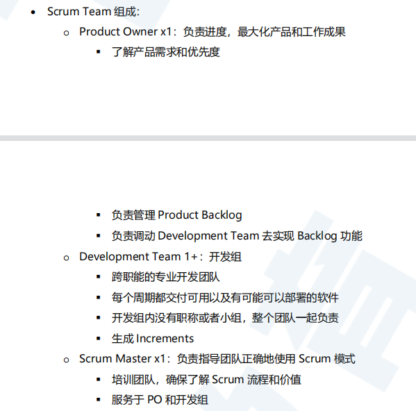

# Git+敏捷开发

瀑布模式适合大型项目 周期长 参与团队多，强调计划。

但是瀑布模式更改需求会造成延长开发周期及预算膨胀，敏捷开发（Agile）更专注迭代(iterative)开发，专注更少的时间在规划和设计上，同时增强团队内部之间以及和客户的沟通，更频繁地获得反馈，迭代完善系统，满足需求。一言以蔽之，敏捷开发=更能容纳改动（Adapt to change）。

开发计划（Development Plan）在敏捷开发中依然重要，规章制度依然定义着团队如何在敏捷模式下推动和项目。区别更加在于，在每个开发循环，团队可以根据新情况，新理解，更改计划。同样地，虽然敏捷模式更加强调实装功能而不是摸鱼写技术文档。技术文档(develop doc)在任何软件开发项目依然重要，区别在于，技术文档不应该是团队内外沟通的唯一方式。

1. 主版本号(MAJOR)：当你做了不兼容的 API 修改，
2. 次版本号(MINOR)：当你做了向下兼容的功能性新增， 3. 修订号(PATCH)：当你做了向下兼容的问题修正。

3. 修订号(PATCH)：当你做了向下兼容的问题修正。

持续集成(Continuous Integration ，CI)指的是让软件系统保持更新，频繁集成(集成软件系统的不同部分）。集成由自动构建执行，并检测任何集成错误。配套的 全方面测试会拒绝任何有问题的 commit，确保代码不会因为修改而导致无法运行。如果测试或者构建失败，开发团队会马上排查这个问题，确保软件尽快恢复上线。

CI 实现：

- 版本控制（如 Git） - 自动构建（如 Gradle） - 规章制度
- 配置管理
- CI 自动化服务（如 Jenkins）

持续交付（Continuous Delivery，CD）是在 CI 的基础上把代码交付到生产环境，为 了向客户稳定快速地实现和交付新功能

持续部署（Continuous Deployment，CD）比持续交付更进一步，持续交付的部署
到生产环境仍然需要人工操作，也可以人为决定多长时间才把更新推到生产环境。而 持续部署尽可能自动化这个过程，如果构建和测试通过，则会被随即部署到生产环境。 这对配置和测试水平的要求也大幅提高

Scrum精益：

开源deployment协议区别：[https://blog.csdn.net/testcs_dn/article/details/38496107](https://blog.csdn.net/testcs_dn/article/details/38496107)

Git： pro git

git不是增量更新，而是全量更新，**使用快照来保存版本而不是进行差异比较。**听起来全量更新会耗费大量的空间，但是git在这里进行了优化：项目中的每个文件都作为文件存储在Git子目录中，以其内容的哈希命名，所以对于新提交未修改的文件，哈希值没有更改，新快照中指向这个文件的指针会指向已经有的同一份文件，不会开新空间存储没有修改的文件。

- 工作区workspace：仓库的目录。**工作区是独立于各个分支的**；
- 暂存区index：数据暂存点区域，类似于工作区写入版本库前的缓冲区。**暂存区是独立于各个分支的**；
- 本地仓库repository：所有离线操作都可以在本地完成，等需要的时候再和远程服务进行交互。

git add 把已修改文件放到暂存区

git commit 把已暂存文件生成快照到仓库区，新的commit object 都会有一个指针指向前一版本

代码撤销和撤销同步：

git指令：

**git init** 将当前目录初始化为git 目录

**git remote add origin xxx/address.git**：将本地仓库关联到远程仓库（先在本地git init建目录，再和远程仓库关联，接下来就可以将本地项目上传到远程仓库）

**git status**: 查看仓库的修改状态

`git add xxx`：将xxx文件添加到暂存区。`git add .`：将所有修改过的文件添加到暂存区

`git commit -m "xxx"`：将暂存区内容提交到当前分支（持久化为一个节点，xxx为给自己看的备注信息）

`git push`：将当前分支推送到远程仓库的对应分支

`git branch`：查看所有分支和当前所处分支

`git diff xxx`: 查看xxx文件相对于暂存区的修改内容

**git branch XX**：创建一个名为XX的分支，创建的时候需要注意看一下自己是在本地库还是远程库中。一般建议在本地库中创建，然后提交的时候再放到远程库中。

**git checkou XX**：切换到名为XX的分支

**git merge XX**：合并XX分支上的内容到当前分支，合并以后如果有冲突，最好手动解决，不要用强制覆盖的方式，强制覆盖多了总会出问题的。

分支及版本管理：

使用git的每次提交，Git都会自动把它们串成一条时间线，这条时间线就是一个分支。如果没有新建分支，那么只有一条时间线，即只有一个分支，在Git里，这个分支叫主分支，即master分支。有一个HEAD指针指向当前分支（只有一个分支的情况下会指向master，而master是指向最新提交）。每个版本都会有自己的版本信息，如特有的版本号、版本名等。如下图，假设只有一个分支：

**如何撤销已经commit的提交**：

有reset和revert两种方法

**git reset**: 作用是修改HEAD的位置，即将HEAD指向的位置改变为之前存在的某个版本. 适用于恢复到之前某个提交的版本，且那个版本之后提交的版本我们都不要了

先用git log 查看历史commit的版本id 

**git reset --hard 回退版本的commitID**

（soft和hard以及默认的mixed区别：soft会保留从回退版本到当前的所有修改在工作区域，hard会丢失所有的修改，mixed会保留从回退版本到当前的所有修改在工作区，如果再执行git checkout撤销当前的修改就等价于hard）

注意回退后如果要push到远程库，需要加-f强制推送，不然会报错

git push -f

**git revert**:git revert是用于“反做”某一个版本，以达到撤销该版本的修改的目的。新建了一个与原来完全相反的commit，抵消了原来commit的效果。比如，我们commit了三个版本（版本一、版本二、 版本三），突然发现版本二不行（如：有bug），想要撤销版本二，但又不想影响撤销版本三的提交，就可以用 git revert 命令来反做版本二，生成新的版本四，这个版本四里会保留版本三的东西，但撤销了版本二的东西

先用git log 查看历史commit的版本id 

**git revert -n 回退版本的commitID**

**本地有修改且和pull文件冲突时**：

git stash ，git pull git ，stash pop

当然使用sourcetree更方便

撤销暂存区文件到工作区：`git checkout <file-name>`

恢复暂存区的所有文件到工作区 `git checkout .`

将多个commit合并为一个： git rebase -i HEAD~4  将最近4个commit合并为一个

修改commit的信息 `git commit --amend`