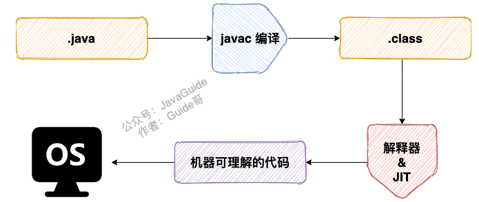

# Java基础

JVM：运行字节码的虚拟机，是字节码跨平台的实现，针对不同系统不同实现

JRE：运行时环境，运行已编译java程序的工具集，包括JVM，JAVA类库和其他一些基础构件，不能用于创建新程序

JDK：包括JRE，还包括编译器javac 和一些其他工具 jdb、javadoc，可以创建和编译程序

字节码：.class文件



JVM的解释器逐行解释执行字节码（一句一句解释），后来又引入JIT运行时编译器（一次性编译完成），第一次编译完成后会把对应的机器码保存下来，对于热点代码进行编译，其他代码解释

编译与解释并存：因为 Java 程序要经过先编译，后解释两个步骤，由 Java 编写的程序需要先经过编译步骤，生成字节码（`.class`文件），这种字节码必须由 Java 解释器来解释执行。

java和c++的异同：

1、都是面向对象：封装、继承、多态

2、java 没有指针，内存安全

3、java类是单继承，更没有菱形继承，只是使用接口支持多继承

4、有GC机制，不需要析构函数来手动释放内存

5、java没有操作符重载

可变参数...：(String... s) 实际被读入为一个数组 String[] s1 = s;


重载和重写：

重载（编译器）就是同样的一个方法能够根据输入数据的不同，做出不同的处理

重写（运行期）就是当子类继承自父类的相同方法，输入数据一样，但要做出有别于父类的响应时，你就要覆盖父类方法

1. 方法名、参数列表必须相同，**子类方法返回值类型应比父类方法返回值类型更小或相等，抛出的异常范围小于等于父类，访问修饰符范围大于等于父类。**
2. 如果父类方法访问修饰符为 `private/final/static` 则子类就不能重写该方法，但是被 `static` 修饰的方法能够被再次声明。
3. 构造方法无法被重写


如果类没有重写equals方法，则等价于用”==”来比较类的对象。

String是有常量池的，因此创建String时会在常量池中查找有没有已经存在的值和要创建的值相同的对象，如果有就把它赋给当前引用。如果没有就在常量池中重新创建一个

**equals()与HashCode**()：

Hashcode()默认是返回类内存地址的哈希值，equals()默认是比较两个类的内存地址是否相同，所以想通过类的属性判断两个实例是否相同时，就需要重写equals()方法，而当对该类进行一些hash有关的容器操作时(如hashmap，hashset)，必须要重写hashcode()，否则会出现属性相同的类却被重复加入set中，因为这些容器是先比较hashcode（），如果有hashcode相同则继续调用equals()方法进一步检查是否相同(这样减少了equals的调用次数，提高了执行速度）。 所以这就是为什么重写equals一定也要重写hashcode → 为了在和hash相关的集合中有正确表现

总结就是：equals相同，那么hashcode一定要相同。hashcode相同，equals不一定相同(哈希碰撞)

**为什么hashcode方法大多选择31作为生成hash值的乘数**：

一、31=(1 << 5) - 1，可以被JVM优化

 二、31是质数中一个“不大不小”的存在，如果使用的是一个如2的较小质数，
那么得出的乘积会在一个很小的范围，很容易造成哈希值的冲突。而如果选择一个100以上的质数，得出的哈希值会超出int的最大范围，这两种都不合适。

8种基本数据类型

需要注意的是java的char是2个字节，和c++不同，char的包装类型为Character

包装类型不赋值默认为null（防止NPE），基本类型不赋值有默认值


数值类型的包装类型基本都有常量池: Integer Long[-128,127] Character[0,127]


基本类型可以用==比较，但是包装类型一定要用equals比较，哪怕有常量池


构造方法没有返回值，但不能用 void 声明构造函数。且默认会有无参构造方法，但是如果添加了有参构造方法，就不会自动生成无参构造方法，因此如果重载了有参的构造方法，记得要把无参的构造方法也写出来

访问权限：不加修饰符，表示包级可见，

protected只能修饰成员，因为在继承体系中表示成员对于子类可见

接口从java8开始可以拥有默认的方法实现，接口的字段和方法默认是public的，并且不能为private或protected，并且默认为static和final的

final:类不能被继承，方法不能被子类重写，基本类型不能变，引用类型不能再引用其他对象

面向对象三大特征：

封装：对象的属性隐藏在内部，不允许直接访问，提供一些方法来操作和访问

继承：

多态：表示一个对象具有多种的状态，具体表现为父类的引用指向子类的实例


**深拷贝和浅拷贝及引用拷贝**：


String为什么不能修改：虽然final修饰了 byte[]数组（final修饰的基本类型不能改变，修饰的引用类型不能再指向其他对象），但这个不是string不能修改的原因（引用还是可以变的)，原因是数组是private的且没有提供修改方法，而String类被final修饰不能被继承，所以不会有子类破坏String不可变性

1. 操作少量的数据: 适用 `String`
2. 单线程操作字符串缓冲区下操作大量数据: 适用 `StringBuilder`
3. 多线程操作字符串缓冲区下操作大量数据: 适用 `StringBuffer`

**泛型**：提供了编译时类型安全检测机制，是编译期去掉的语法糖（类型擦除），本质是参数化类型，也就是说所操作的数据类型被指定为一个参数。同一泛型类共用一份字节码，共用静态变量。

限定通配符-集合中要写用super（比如参数类型限定），要读用extends（比如返回类型限定），都要就不用：

extends X的集合是不能调用add的，只能在初始化时赋一个X的子类的List给他，所以extends只能读，读的时候可以取X及X的超类，类型擦除后擦除到X，

super X的集合可以add X或X的子类，不能add X的父类（因为不知道具体是X的哪个父类，所以不允许加入X的超类），读取的时候因为此时不知道是什么类型，所以只能返回object，因此super可以写不能读。类型擦除后擦除到Object


h[ttps://blog.csdn.net/w372426096/article/details/78081552](https://blog.csdn.net/w372426096/article/details/78081552)

[https://princeyao.blog.csdn.net/article/details/86674481?spm=1001.2101.3001.6650.2&utm_medium=distribute.pc_relevant.none-task-blog-2~default~BlogCommendFromBaidu~Rate-2.queryctrv4&depth_1-utm_source=distribute.pc_relevant.none-task-blog-2~default~BlogCommendFromBaidu~Rate-2.queryctrv4&utm_relevant_index=5](https://princeyao.blog.csdn.net/article/details/86674481?spm=1001.2101.3001.6650.2&utm_medium=distribute.pc_relevant.none-task-blog-2%7Edefault%7EBlogCommendFromBaidu%7ERate-2.queryctrv4&depth_1-utm_source=distribute.pc_relevant.none-task-blog-2%7Edefault%7EBlogCommendFromBaidu%7ERate-2.queryctrv4&utm_relevant_index=5)

因为是语法糖，所以运行期间可以通过反射添加非泛型类元素


项目哪里用到了泛型？todo

**反射**：赋予了我们在运行时分析类以及执行类中方法的能力。通过反射可以获取任意一个类的所有属性和方法，还可以调用这些方法和属性

类设置accessable为true可以访问和修改私有变量、方法


*getDeclaredMethod()*获取的是**类自身**声明的所有方法，包含**public**、**protected**和**private**方法。*getMethod()*获取的是类的所有共有方法，这就包括自身的**所有public**方法，和从基类继承的、从接口实现的所有public方法。

**反射原理**：invoke方法的底层原理：Method的invoke方法进行了一些权限检查，最后调用了MethodAccessor的invoke方法，MethodAccessor是一个接口，我们需要去acquireMethodAccessor（）中看究竟返回的是哪个具体实现，在这里面是调用ReflectionFactory的newMethodAccessor方法来生成一个对象，首先生成了一个NativeMethodAccessorImpl对象，再将它作为参数调用DelegatingMethodAccessorImpl类的构造方法，这里使用了代理模式，将NativeMethodAccessorImpl交给DelegatingMethodAccessorImpl类代理，所以最终ReflectionFactory类生成的是DelegatingMethodAccessorImpl对象，但这个对象其实本质是代理的NativeMethodAccessorImpl，所以调用的是NativeMethodAccessorImpl的invoke方法，而这个invoke方法会判断历史调用次数是否超过某个阈值，如果超过则生成一个新的MethodAccessorImpl对象，并使代理类DelegatingMethodAccessorImpl代理这个新对象。原因是实际的MethodAccessor有native和java两个版本，Native 版本（c++相关代码）一开始启动快，但是随着运行时间边长，速度变慢。Java 版本一开始加载慢，但是随着运行时间边长，速度变快。正是因为两种存在这些问题，所以第一次加载的时候我们会发现使用的是 NativeMethodAccessorImpl 的实现，而当反射调用次数超过 15 次之后，则使用 MethodAccessorGenerator 生成的 MethodAccessorImpl 对象去实现反射。

总结：invoke→reflectionFactory→delegatingMethodAccessorImpl→nativeMethodAccessorImpl→ 调用超过一定次数则MthodAccessorImpl

**静态代理和动态代理**：

[https://www.cnblogs.com/gonjan-blog/p/6685611.html](https://www.cnblogs.com/gonjan-blog/p/6685611.html)

[https://www.cnblogs.com/jingmoxukong/p/12049112.html](https://www.cnblogs.com/jingmoxukong/p/12049112.html)

静态代理就是代理模式，为其他对象提供一种代理以控制对这个对象的访问


静态代理模式固然在访问无法访问的资源，增强现有的接口业务功能方面有很大的优点，但是大量使用这种静态代理，会使我们系统内的类的规模增大，并且不易维护；并且由于 Proxy 和 RealSubject 的功能本质上是相同的，Proxy 只是起到了中介的作用，这种代理在系统中的存在，导致系统结构比较臃肿和松散。

为了解决静态代理的问题，引入了动态代理，运行状态中，需要代理的地方，根据 Subject 和 RealSubject，动态地创建一个 Proxy，用完之后，就会销毁，这样就可以避免了 Proxy 角色的 class 在系统中冗杂的问题

**动态代理**：核心-InvocationHandler和Proxy。invocationhandler这个接口只有一个invoke方法，它的实现充当一个代理类的作用，InvocationhandlerImpl包含一个被代理的类，使用invoke方法来进行方法调用（这里其实也有AOP的影子，通过InvocationHandler的invoke来在调用方法的前后进行切面操作）


我们创建InvocationhandlerImpl后，使用这个impl作为参数，调用Proxy的newProxyInstance静态方法来产生一个动态代理类，这个类继承了proxy并且实现了被代理的接口（jdk的动态代理只能代理接口，即实现了某个接口的类，对于没有实现任何接口的类，需要使用cglib的动态代理技术,cglib基于让Proxy去继承RealSubject），这个类持有InvocationhandlerImpl对象，所以对这个类的方法调用最终会变为InvocationhandlerImpl invoke的调用，这个动态代理类是运行时动态在JVM中创建的，所以他的class叫做$ProxyX(X代表编号)，

newProxyInstance的具体操作：

首先调用Proxy.getProxyClass(classLoader（被代理对象的类加载器）,Interfaces（被代理对象所实现的接口）)来生成动态代理类. 再用反射来获取动态代理类的constructer，再调用这个constrctuer并且将handler传入作为参数。

引申：代理模式的意义：远程调用就用到了代理模式，客户端调用代理模式和远程对象建立联系，省去了直接调用的处理网络服务这一步。代理类最重要的功能就是做权限控制，在代理类进行权限判断，还有切面、日志和拦截器也是这样

**注解**：本质是继承了annotation的接口，注解只有被解析之后才会生效，常见的解析方法有两种：

- **编译期直接扫描** ：编译器在编译 Java 代码的时候扫描对应的注解并处理，比如某个方法使用`@Override` 注解，编译器在编译的时候就会检测当前的方法是否重写了父类对应的方法。
- **运行期通过反射处理** ：像框架中自带的注解(比如 Spring 框架的 `@Value` 、`@Component`)都是通过反射来进行处理的。

[https://juejin.cn/post/6844904167517995022](https://juejin.cn/post/6844904167517995022)

[https://juejin.cn/post/6844904168491073543](https://juejin.cn/post/6844904168491073543)


**异常**：所有的异常都有一个共同的祖先 `java.lang` 包中的 `Throwable` 类。`Throwable` 类有两个重要的子类:

- **`Exception`** :程序本身可以处理的异常，可以通过 `catch` 来进行捕获。`Exception` 又可以分为 Checked Exception (受检查异常，必须处理) 和 Unchecked Exception (不受检查异常，可以不处理)。
- **`Error`** ：`Error` 属于程序无法处理的错误 ，我们没办法通过 `catch` 来进行捕获 。例如Java 虚拟机运行错误（`Virtual MachineError`）、虚拟机内存不够错误(`OutOfMemoryError`)、类定义错误（`NoClassDefFoundError`）等 。这些异常发生时，Java 虚拟机（JVM）一般会选择线程终止。


Checked Exception在编译过程中必须被 `catch`/`throw` 处理

任何实现 `java.lang.AutoCloseable`或者 `java.io.Closeable`的对象都可以被称为资源，对于资源的使用，用Try-with-resources 替代 Try-catch-finally，可以自动close，并且可以很简单的处理多个资源的开关


**序列化和IO**：Serializable接口

`transient`修饰类中不想序列化的字段（只能修饰变量），被修饰的变量反序列化后会被设置为类型的默认值。需要注意的是，静态变量因为不属于任何对象，所以无论有没有transient，都不会被序列化，被反序列化时会先去JVM找有没有这个类，有的话输出这个类文件的该静态变量值, JVM没有加载这个类的话就会为默认值


****有了字节流,为什么还要有字符流：****

字符流是由 Java 虚拟机将字节流转化为2个字节的Unicode字符得到的，问题就出在这个过程还算是非常耗时，并且，如果我们不知道编码类型就很容易出现乱码问题。所以， I/O 流就干脆提供了一个直接操作字符的接口，方便我们平时对字符进行流操作。如果音频文件、图片等媒体文件用字节流比较好，如果涉及到字符的话使用字符流比较好。字符流可以直接处理Unicode字符，

是值传递不是引用传递的原因：


**BIO NIO AIO 到IO多路复用-POLL&EPOLL：**

BIO和NIO都是同步IO，它们字面的区别是阻塞/非阻塞，实质最大的区别在于分别以流和块的方式处理数据，块 I/O 的效率比流 I/O 高很多。BIO处理多个连接需要分别开多个线程处理，因为是阻塞的。

AIO是异步非阻塞，不需要有Selector去轮询，由操作系统完成后会自动通知程序启动线程去处理，基于操作系统底层的异步API

NIO的组成和原理：

JAVA的NIO其实叫New IO，在Non-blocking IO 的基础上还增加了多路复用的思想

NIO由Channel、buffer、Selector组成，实际上实现了IO多路复用中的Reactor思想，一个线程 Thread 使用一个选择器 Selector 通过轮询的方式去监听多个通道 Channel 上的事件，只有套接字Channel才能配置为非阻塞，Filechannel不能，因为也没有意义

**Buffer**: 一块连续内存，底层是一个数组，实现了零拷贝，读取和写入数据都需要通过buffer，用flip()切换读写模式。常用ByteBuffer

**Channel**：Channel是双向的，BIO的流不是双向的，只能读或者写。

channel.read(buffer)从通道中把数据读到buffer中

channel.write(buffer)从buffer中把数据写到通道中

FileChannel、DatagramChannel、SocketChannel、SocketServerChannel

**Selector**：


每个通道都需要注册到Selector上，注册时必须指定监听的具体事件（可以单个可以多个，不同位 或一下就可以）


Selector会轮询的去询问注册通道是否有指定事件到达，当使用者调用Selector.select()时会返回到达通道的数量，若都没有事件到达，则会阻塞到至少有一个事件到达或者到timeout（select函数是阻塞的）。看源码发现select的doselect有两个实现，一个是WEpoll 一个是windowSelector

 使用`selectedKeys`来获取到达的事件及对应通道


NIO的一个缺点是只能用单线程调用select来处理IO

Selector基于select/poll模型实现，是基于IO复用技术的非阻塞IO，不是异步IO。在JDK1.5 update10和linux core2.6以上版本，sun优化了Selctor的实现，底层使用epoll替换了select/poll

使用NIO 推荐使用成熟的框架 如Netty

Select/poll和epoll：

select的三个缺点：单个进程能打开文件句柄最多1024个，每次调用都要把句柄集合从用户态拷贝到内核态，扫描是轮询的线性扫描，

poll没有了句柄的限制，其他一样

epoll不需要轮询，做到了触发时回调，有新的事件来时会进行提示

水平触发和边缘触发：一个只在新事件来时提醒一次，一个在队列中还有未处理事件时一直提醒。

epoll高效的原因：[https://www.jianshu.com/p/31cdfd6f5a48](https://www.jianshu.com/p/31cdfd6f5a48)

[https://mp.weixin.qq.com/s/YdIdoZ_yusVWza1PU7lWaw](https://mp.weixin.qq.com/s/YdIdoZ_yusVWza1PU7lWaw)

**零拷贝**：避免在用户态和内核态之间来回拷贝的技术，NIO的零拷贝有两种实现

FileChannnel是基于transferTo()这个方法，它调用了native的transferTo方法，基于操作系统的底层实现（sendfile），从内核直接传输到sokcet buffer，避免了用户态和内核态之间的数据拷贝

MappedBytebuffer这种是基于内存直接映射的零拷贝，mmap允许代码将文件映射到内核内存并直接访问它，就好像它在用户空间中一样，从而避免了不必要的复制

sendfile适合大文件，mmap适合小数据

**集合/容器**：

数组本质是类，是虚拟机运行时自动创建的类型，这个类的命名以“[”开头，几个表示几维，接着是数组中元素的类型，比如String[]  getclass().getname()是[Ljava.lang.String。（[https://blog.csdn.net/zhangjg_blog/article/details/16116613#t1](https://blog.csdn.net/zhangjg_blog/article/details/16116613#t1)）


List：

ArrayList适用于频繁的查找工作，线程不安全

Vector是很古老的实现类，线程安全，效率相对差

LinkedList适合频繁的两端增删，也是线程不安全的

**List如何正确遍历删除**：

用增强for循环遍历判断删除会报ConcurrentModificationException。增强for循环是iterator的语法糖，iterator.next()时会调用checkForComodification比较modCount和expectedModCount的值是否相等，当我们删除了后这里就不相等了。

这里的modCount其实提供的就是Fail-Fast机制，对于非线程安全的集合都会有ModCount，在迭代过程中若不相同则抛出异常防止继续遍历.

与之相对的有fail-safe机制：遍历时先复制原有集合内容，在拷贝集合上进行遍历，且对增删等方法加锁（避免copy出n个副本，导致并发写）；concurrent包下容器都实现了该机制

正确操作：1. iterator.remove()会把两个值重新赋值


1. for循环+list.get(i)正序删除，删除后将i=i-1
2. for循环+list.get(i)倒序删除

 4.  java8之后新特性:removeIf()


因为Arrays.asList返回的是java.util.Arrays的一个内部类，没有实现集合的修改方法

   ArrayList如果要在指定位置 i 插入和删除元素的话（`add(int index, E element)`）时间复杂度就为 O(n-i)。因为在进行上述操作的时候集合中第 i 和第 i 个元素之后的(n-i)个元素都要执行向后位/向前移一位的操作。

   `LinkedList` 采用链表存储，所以，如果是在头尾插入或者删除元素不受元素位置的影响（`add(E e)`、`addFirst(E e)`、`addLast(E e)`、`removeFirst()` 、 `removeLast()`），近似 O(1)，如果是要在指定位置 `i` 插入和删除元素的话（`add(int index, E element)`，`remove(Object o)`） 时间复杂度近似为 O(n) ，因为需要先移动到指定位置再插入。

   内存空间占用**：** ArrayList 的空 间浪费主要体现在在 list 列表的结尾会预留一定的容量空间，而 LinkedList 的空间花费则体现在它的每一个元素都需要消耗比 ArrayList 更多的空间（因为要存放直接后继和直接前驱以及数据）。

ArrayList扩容分析：

以无参数构造方法创建 `ArrayList` 时，实际上初始化赋值的是一个空数组。当真正对数组进行添加元素操作时，才真正分配容量。即向数组中添加第一个元素时，数组容量扩为 10（10是default_capacity）

每次minCapacity(当前最少需要的)大于当前capacity的时候，首先将capacity扩大为1.5倍，若还是小于minCapacaity，那么直接设置为minCapacity

**System.ArrayCopy**:是一个用于数组复制的native方法

在arraylist的add(index,object)中，要把index之后的元素都往后挪，就是使用这个native方法实现数组自己的移位复制


**Arrays.Copyof**： 调用的就是System.ArrayCopy


 自我扩容调用的就是Arrays.copyof函数


ArrayDeque和LinkedList：arraydeque也是线程不安全


**HashMap ConcurrentHashMap HashTable**:

Hashtable是线程安全（synchronized）但这个类已经被淘汰了

`HashMap` 可以存储 null 的 key 和 value


**哈希值要进行哈希扰动的原因**？

```java
// 把哈希值右移16位再与原值异或
return (key == null) ? 0 : (h = key.hashCode()) ^ (h >>> 16);
```

混合了原哈希值中的高位和低位，增大了随机性，让数据元素更加均衡的散列，减少碰撞

**Jdk8哈希扩容的优化**？


在扩充HashMap的时候，不需要像JDK1.7的实现那样重新计算hash，只需要看看原来的hash值新增的那个bit是1还是0就好了，是0的话索引没变，是1的话索引变成“原索引+oldCap”


**哈希表为什么链表长了要用红黑树而不是二叉平衡树**？

红黑树是一种宽泛条件下的平衡树，平衡树严格要求左右绝对值高度小于等于1，因此插入删除时需要旋转的次数更多，红黑树可以理解为一种相对平衡的二叉树，避免了二叉树的O（n）最坏时间复杂度，又比二叉平衡树效率相对高

***hashmap的长度为什么要是2的幂次方***（初始化输入为其他数也会初始化为最小的大于它的2的幂）：

计算方便：因为计算插入位置时要用到 hashKey%mapSize，但是%号其实很慢，所以如果mapsize是2的幂次方的话，这个式子可以用位运算&来优化：hashKey&（mapSize-1）;

hash分布更均匀：并且2的幂次方是偶数，mapSize-1最后一位是1，如果是奇数的话那最后一位是0，任何 hash 值都**只会被**散列到数组的**偶数下标位置**上，浪费了很多空间，增大了哈希碰撞发生的概率（只要不是2的幂次方的数，都会有可能某一位被忽略，只有2的幂次方-1是全为1的）

`ConcurrentHashMap`: jdk1.7分段锁： **Segment 数组 → Node 数组（jdk1.8），采用 CAS 和 synchronized 来保证并发安全:**

put的时候， 首先计算hash，遍历node数组，如果node是空的话，就通过CAS+自旋的方式初始化，如果当前数组位置是空则直接通过CAS自旋写入数据，就使用synchronized写入数据，写入数据同样判断链表、红黑树，链表写入和HashMap的方式一样，key hash一样就覆盖，反之就尾插法


HashMap：

初始大小16，负载因子0.75


LRU- LinkedHashMap.removeEldestEntry


WaekhashMap：通过弱引用来管理entry entry 可能会被GC自动删除***WeakHashMap* 的这个特点特别适用于需要缓存的场景**。在缓存场景下，由于内存是有限的，不能缓存所有对象；对象缓存命中可以提高系统效率，但缓存MISS也不会造成错误，因为可以通过计算重新得到。

JAVA8新特性：

1.lambda表达式+函数式编程：最简单的运用就是PriorityQueue不用写Comparator了，直接用lambda表达式。还有就是list.forEach() list.steam().xxx.collect(Collectors.toList())

****@FunctionInterface四大函数式接口：****

Consumer< T> void accept(T t)

Supplier < T> T get()

Predicate<T> boolean test(T t)

Function<T,R> R apply(T t)

2.Optional类处理NPE问题

```java
Optional empty= Optional.ofNullable(zoo).map(o -> o.getDog()).map(d -> d.getAge()).filter(v->v==1).orElse(3);
System.out.println(empty.orElseGet(() -> "Default Value"));
```

3.日期Date-Time类

temporal.TemporalAdjusters

4.接口允许defalut实现

**Spring和Springboot**：

**IOC控制反转**：

Spring框架管理这些Bean的创建工作，即由用户管理Bean转变为框架管理Bean，这个就叫**控制反转 - Inversion of Control (IoC)** Spring 框架托管创建的Bean放在哪里呢？ 这便是**IoC Container**; Spring 框架为了更好让用户配置Bean，必然会引入**不同方式来配置Bean？ 这便是xml配置，Java配置，注解配置**等支持

应用程序代码从Ioc Container中获取依赖的Bean，注入到应用程序中，这个过程叫 **依赖注入(Dependency Injection，DI)** ； 所以说控制反转是通过依赖注入实现的，其实它们是同一个概念的不同角度描述。通俗来说就是**IoC是设计思想，DI是实现方式** 在依赖注入时，有哪些方式呢？这就是构造器方式，@Autowired, @Resource, @Qualifier..

传统应用程序是由我们自己在对象中主动控制去直接获取依赖对象，也就是正转；而反转则是由容器来帮忙创建及注入依赖对象；为何是反转？因为由容器帮我们查找及注入依赖对象，对象只是被动的接受依赖对象


**AOP面向切面**：

Spring 框架通过定义切面, 通过拦截切点实现了不同业务模块的解耦。基于动态代理技术实现了AOP，动态代理又是基于反射

Springboot 基于约定优于配置的思想，没有代码生成，也无需XML配置