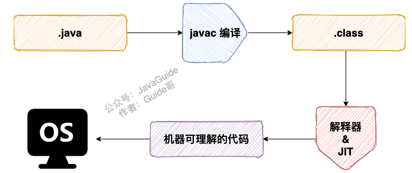

# JVM

字节码：



class文件本质是一个8位字节为基础单位的二进制流，


线程隔离的数据区不会有垃圾，也不会有垃圾回收。gc都是发生在方法区和堆

**一.JVM内存结构**

**虚拟机栈**：主管 Java 程序的运行，它保存方法的局部变量、部分结果，并参与方法的调用和返回，访问速度仅次于程序计数器。局部变量包括：基本类型+对象引用，**每个线程都有自己的栈**

可以通过-Xss设置线程的最大栈空间


（1）局部变量表：存储方法参数和在方法内部定义的局部变量，包括基本数据类型、对象引用。由于栈是线程私有的，所以这里不存在数据安全问题。

每一个方法的局部变量表大小是在编译器确定下来的，保存在方法字节码中，运行期间不会改变局部变量表的大小。随着方法栈帧的销毁，局部变量表也会随之销毁

（2）操作数栈：主要用于保存计算过程的中间结果，同时作为计算过程中变量临时的存储空间

（3）动态链接：指向所属方法的引用，目的就是为了支持当前方法的代码能够实现动态链接

Class 文件的编译过程中不包括传统编译器中的连接步骤，一切方法调用在 Class文件里面存储的都是**符号引用**，而不是方法在实际运行时内存布局中的入口地址（**直接引用**）。也就是需要在类加载阶段，甚至到运行期才能确定目标方法的直接引用。


（4）方法返回地址：上一个栈方法的地址

**本地方法栈**：Native关键字-被Native修饰的函数会去本地方法栈调用本地方法接口JNI（java native interface）。 本地方法栈是专门开辟的区域用来登记native方法  **在 Hotspot JVM 中，实质上将本地方法栈和虚拟机栈合二为一**

**程序计数器**：每个线程都有一个私有的指针，即程序计数器，指向方法区中的方法字节码（所属线程下一个要执行的指令的地址），是一个非常小的内存空间，但是也单独划了一片区域。


如果当前线程正在执行的是 Java 方法，程序计数器记录的是 JVM 字节码指令地址，如果是执行 native 方法，则是未指定值（undefined）

**唯一一个在 JVM 规范中没有规定任何 `OutOfMemoryError` 情况的区域**

**堆**：栈主管程序运行的相关数据，堆主管需要存储的数据。存放对象实例，被所有线程共享。堆可以是处于物理上不连续的内存空间中，只要逻辑上是连续的即可，像磁盘空间一样。实现时，既可以是固定大小，也可以是可扩展的，主流虚拟机都是可扩展的（通过 `-Xmx` 和 `-Xms` 控制），如果堆中没有完成实例分配，并且堆无法再扩展时，就会抛出 `OutOfMemoryError` 异常

从逻辑上被划为三个部分（分代是为了优化GC性能）：

**年轻代**：再细分为三个区，Eden，幸存者0和幸存者1区，内存比例为8:1:1。当Eden空间被填满时，执行Minor GC，将所有没有被删除的对象和已有的幸存者区对象都移动到一个幸存者区中，所以每次Min GC，一个幸存者空间总是空的。经过多次 GC 循环后存活下来的幸存者对象被移动到老年代。通常，这是通过设置年轻一代对象的年龄阈值来实现的，然后他们才有资格提升到老一代

**老年代**：当老年代满时，会触发major GC。大对象会直接进入老年代，避免在Eden，幸存者区之间发生大量的内存拷贝。

**元空间**（1.8之前叫永久代）：虚拟机规范中方法区的实现，虽然叫非堆但是在1.8之前实际也是用的堆内存，1.8改为直接使用物理内存而不是JVM的内存。和方法区对应，具体看后面。


新生代和老年代的比例默认是1:2， 可以进行配置： -XX:Newratio 3 表示设置老年代是新生代的3倍

-XX:Surviorratio： 调节Eden和一个Survivor的比例，默认为8:1

XX:+UseAdaptiveSizePolicy JVM会自动调整各区域大小及进入老年代的年龄，并且在jdk8中默认是开启的，不要随意关闭

XX:MaxTenuringThreshold：默认为15，新生代对象活过gc的相应次数即可升级到老年代

区分几种GC：

老年代的major GC 不是 full GC


逃逸分析技术：**Java 虚拟机中比较前沿的优化技术。这是一种可以有效减少 Java 程序中同步负载和内存堆分配压力的跨函数全局数据流分析算法**。通过逃逸分析，Java Hotspot 编译器能够分析出一个新的对象的引用的使用范围从而决定是否要将这个对象分配到堆上。

逃逸分析的基本行为就是分析对象动态作用域：

- 当一个对象在方法中被定义后，对象只在方法内部使用，则认为没有发生逃逸。
- 当一个对象在方法中被定义后，它被外部方法所引用，则认为发生逃逸。例如作为调用参数传递到其他地方中，称为方法逃逸。

JIT 编译器在编译期间根据逃逸分析的结果，发现如果一个对象并没有逃逸出方法的话，就可能被优化成栈上分配。分配完成后，继续在调用栈内执行，最后线程结束，栈空间被回收，局部变量对象也被回收。这样就无需进行垃圾回收了。

常见栈上分配的场景：成员变量赋值、方法返回值、实例引用传递

JIT 编译器可以借助逃逸分析来判断同步块所使用的锁对象是否能够被一个线程访问而没有被发布到其他线程。如果没有，那么 JIT 编译器在编译这个同步块的时候就会取消对这个代码的同步。这样就能大大提高并发性和性能。这个取消同步的过程就叫做**同步省略，也叫锁消除**。

通过逃逸分析确定该对象不会被外部访问，并且对象可以被进一步分解时，JVM 不会创建该对象，而会将该对象成员变量分解若干个被这个方法使用的成员变量所代替。这些代替的成员变量在栈帧或寄存器上分配空间。这个过程就是**标量替换**。

对于在堆上创建的对象实例，基本类型的变量值直接存在堆中，引用类型会根据引用类型存储在对应的地方（一般是方法区的常量池）

**方法区**：所有定义的方法的信息都在该区域，所有字段和方法字节码，还有构造函数和接口代码都在这里。 **静态变量，常量、类信息都在方法区（static、final、class模板）， 但是类实例的引用是在堆中的。静态变量和字符串常量池jdk1.7以前在方法区，1.8放在了堆中。其他常量池还是在方法区中**

在JDK1.6及之前运行时常量池逻辑包含字符串常量池存放在方法区, 此时hotspot虚拟机对方法区的实现为永久代（位于堆内存中）

在JDK1.7 字符串常量池被从方法区拿到了堆中, 这里没有提到运行时常量池,也就是说字符串常量池被单独拿到堆,运行时常量池剩下的东西还在方法区, 也就是hotspot中的永久代

在JDK1.8 hotspot移除了永久代用元空间取而代之, 这时候字符串常量池还在堆, 运行时常量池还在方法区, 只不过方法区的实现从永久代变成了元空间(堆外内存)

元空间存储类的元信息，静态变量和字符串常量池等并入堆中（静态域存储于定义类型的Class对象中）。相当于永久代的数据被分到了堆和元空间中

封装类型的常量池都是在各个封装类内部实现的缓存实例，不是JVM层面的实现，所以这里不讨论

运行时常量池：运行时常量池是方法区的一部分。Class 文件中除了有类的版本/字段/方法/接口等描述信息外，还有一项信息是常量池（Constant Pool Table），用于存放编译期生成的各种字面量和符号引用，这部分内容在类加载后进入方法区的运行时常量池中存放。JVM 为每个已加载的类型（类或接口）都维护一个常量池。池中的数据项像数组项一样，是通过索引访问的。，相对于 Class 文件常量池的另一个重要特征是：动态性，Java 语言并不要求常量一定只有编译期间才能产生，运行期间也可以将新的常量放入池中，String 类的 intern() 方法就是这样的

为什么删除永久代？为永久代设置空间大小是很难确定的。如果动态加载类过多，容易产生 Perm 区的 OOM。对永久代进行调优较困难


classLoader和EE的具体构造


创建一个对象（类实例）的过程：

1.类加载检查： 检查这个类是否已经被加载到方法区中，如果没有则先执行类的加载过程

2.分配内存：为新生对象在堆上分配内存，分配方式有指针碰撞和空闲列表，选择哪种分配方法取决于堆空间是否连续决定，堆空间是否连续又有采用的垃圾收集器是否带有压缩整理功能决定。


3.初始化零值****：****内存分配完成后，虚拟机需要将分配到的内存空间都初始化为零值（不包括对象头），这一步操作保证了对象的实例字段在 Java 代码中可以不赋初始值就直接使用，程序能访问到这些字段的数据类型所对应的零值。

4.设置对象头**：**虚拟机要对对象进行必要的设置，例如这个对象是哪个类的实例、如何才能找到类的元数据信息、对象的哈希码、对象的 GC 分代年龄等信息。 这些信息存放在对象头中。 另外，根据虚拟机当前运行状态的不同，如是否启用偏向锁等，对象头会有不同的设置方式。

5.执行 init 方法**：**

二**、类加载器ClassLoader**

加载→验证→准备→解析→初始化

加载：加载是类加载过程的第一个阶段，在加载阶段 虚拟机需要完成以下三件事情:通过一个类的全限定名来获取其定义的二进制字节流。将这个字节流所代表的静态存储结构转化为**方法区的运行时数据结构（运行时常量池）**。在**Java堆中生成一个代表这个类的java.lang.Class对象**，作为对方法区中这些数据的访问入口。


验证：确保被加载的类的正确性，验证文件格式（如字节流是否以cafebabe开头），元数据验证，字节码验证。（不是必须，可以通过-Xveriifnone来关闭）

准备：为类的静态变量在方法区分配内存

解析：把类中的符号引用转换为直接引用

卸载：卸载的三个前提，满足也不一定被卸载

1. 该类的所有的实例对象都已被 GC，也就是说堆不存在该类的实例对象。
2. 该类没有在其他任何地方被引用
3. 该类的类加载器的实例已被 GC

jdk 自带的 BootstrapClassLoader, ExtClassLoader, AppClassLoader 负责加载 jdk 提供的类，所以它们(类加载器的实例)肯定不会被回收。而我们自定义的类加载器的实例是可以被回收的，所以使用我们自定义加载器加载的类是可以被卸载掉的 

类加载有三种方式:

1、命令行启动应用时候由JVM初始化加载

2、通过Class.forName()方法动态加载

3、通过ClassLoader.loadClass()方法动态加载


类加载器的级别：

0、自定义的类加载器：可以在执行非置信代码之前，自动验证数字签名。可以动态地创建符合用户特定需要的定制化构建类。可以从特定的场所取得java class，例如数据库中和网络中。

1、应用程序加载器(AppClassLoader)：加载用户类路径ClassPath指定的类，

2、扩展类加载器（ExtClassLoader）：加载%JRE_HOME%/lib/ext目录中的所有类库(javax.*开头的类) 代表标准api外的扩展类。

3、启动类(根)加载器 (Bootstrap ClassLoader) c++实现，是JVM自身的一部分。所有java.*开头的类都被它加载，rt.jar。负责加载 `%JAVA_HOME%/lib`目录下的 jar 包

这里的级别不是通过继承关系实现，而是通过组合，APPClassLoader.getParent()可以得到扩展类加载器。

JVM类加载的特点：
**全盘负责**，当一个类加载器负责加载某个Class时，该Class所依赖的和引用的其他Class也将由该类加载器负责载入，除非显示使用另外一个类加载器来载入
父类委托，先让父类加载器试图加载该类，只有在父类加载器无法加载该类时才尝试从自己的类路径中加载该类
**缓存机制**，缓存机制将会保证所有加载过的Class都会被缓存，当程序中需要使用某个Class时，类加载器先从缓存区寻找该Class，只有缓存区不存在，系统才会读取该类对应的二进制数据，并将其转换成Class对象，存入缓存区。这就是为什么修改了Class后，必须重启JVM，程序的修改才会生效
**双亲委派机制,** 如果一个类加载器收到了类加载的请求，它首先不会自己去尝试加载这个类，而是把请求委托给父加载器去完成，依次向上，因此，所有的类加载请求最终都应该被传递到顶层的启动类加载器中，只有当父加载器在它的搜索范围中没有找到所需的类时，即无法完成该加载，子加载器才会尝试自己去加载该类。

双亲委派机制过程
当AppClassLoader加载一个class时，它首先不会自己去尝试加载这个类，而是把类加载请求委派给父类加载器ExtClassLoader去完成。
当ExtClassLoader加载一个class时，它首先也不会自己去尝试加载这个类，而是把类加载请求委派给BootStrapClassLoader去完成。
如果BootStrapClassLoader加载失败(例如在$JAVA_HOME/jre/lib里未查找到该class)，会使用ExtClassLoader来尝试加载；
若ExtClassLoader也加载失败，则会使用AppClassLoader来加载，如果AppClassLoader也加载失败，则会报出异常ClassNotFoundException。

**双亲委派优势**

- 系统类防止内存中出现多份同样的字节码
- 保证Java程序安全稳定运行，避免类的重复加载，保证了 Java 的核心 API 不被篡改


JVM的沙箱保护机制：

字节码校验器：加载类时校验类文件是否遵循java语言规范

类装载器：1. 双亲委派机制防止恶意代码去干涉覆盖原有的善意代码

1. 双亲委派机制守护了被信任的类库边界
2. 将代码归入了保护域，确定了代码可以进行哪些操作

为什么需要两个幸存者区：因为新生代执行复制算法进行GC时，如果只有一个幸存者区就会导致内存碎片化，装不下大对象。两个幸存者区会使每次执行复制算法GC时，将两个区域中(eden和from survivor)存活的对象全部转移到To survivor区中，这样就避免了一个survivior区的内存碎片化

**老年代的空间分配担保机制**：

JVM使用分代收集算法，将堆内存划分为年轻代和老年代，两块内存分别采用不同的垃圾回收算法，空间担保指的是老年代进行空间分配担保

**什么是空间分配担保？**

在发生**Minor GC**之前，虚拟机会检查**老年代最大可用的连续空间**是否**大于新生代所有对象的总空间**，

如果大于，则此次**Minor GC是安全的**

如果小于，则虚拟机会查看**HandlePromotionFailure**设置值是否允许担保失败。如果HandlePromotionFailure=true，那么会继续检查老年代最大可用连续空间是否大于**历次晋升到老年代的对象的平均大小**，如果大于，则尝试进行一次Minor GC，但这次Minor GC依然是有风险的；如果小于或者HandlePromotionFailure=false，则改为进行一次Full GC。

**为什么要进行空间担保？**

是因为新生代采用**复制收集算法**，假如大量对象在Minor GC后仍然存活（最极端情况为内存回收后新生代中所有对象均存活），而Survivor空间是比较小的，这时就需要老年代进行分配担保，把Survivor无法容纳的对象放到老年代。**老年代要进行空间分配担保，前提是老年代得有足够空间来容纳这些对象**，但一共有多少对象在内存回收后存活下来是不可预知的，**因此只好取之前每次垃圾回收后晋升到老年代的对象大小的平均值作为参考**。使用这个平均值与老年代剩余空间进行比较，来决定是否进行Full GC来让老年代腾出更多空间。

**JVM垃圾回收**：

如何判断一个对象是否可以回收：

（1）引用计数：给对象添加一个引用计数器，当对象增加一个引用时计数器加 1，引用失效时计数器减 1。引用计数为 0 的对象可被回收。两个对象出现循环引用的情况下，此时引用计数器永远不为 0，导致无法对它们进行回收。正因为循环引用的存在，因此 Java 虚拟机不使用引用计数算法

 （2）可达性分析算法：通过 GC Roots 作为起始点进行搜索，能够到达到的对象都是存活的，不可达的对象可被回收。

GC Roots 一般包含以下内容:

- 虚拟机栈中引用的对象
- 本地方法栈中引用的对象
- 方法区中类静态属性引用的对象
- 方法区中的常量引用的对象
- 所有被同步锁持有的对象


即使在可达性分析中不可达的对象，也不是马上被回收的，真正宣告一个对象死亡，至少要经历两次标记过程；可达性分析法中不可达的对象被第一次标记并且进行一次筛选，筛选的条件是此对象是否有必要执行 `finalize` 方法。当对象没有覆盖 `finalize` 方法，或 `finalize` 方法已经被虚拟机调用过时，虚拟机将这两种情况视为没有必要执行。被判定为需要执行的对象将会被放在一个队列中进行第二次标记，除非这个对象与引用链上的任何一个对象建立关联，否则就会被真的回收。（Object 类中的 finalize 方法一直被认为是一个糟糕的设计，成为了 Java 语言的负担，影响了 Java 语言的安全和 GC 的性能。JDK9 版本及后续版本中各个类中的 finalize 方法会被逐渐弃用移除）

可达性分析：三色标记法。

尚未访问过的为白色

本对象已访问过，但是本对象引用到的其他对象尚未全部访问完。 此时为灰色

本对象已访问过，而且本对象引用到的其他对象也全部访问过了为黑色。

有点像dfs找图中有没有环的记忆化染色？

方法区中主要存放永久对象，回收率很低，因此在方法区上进行回收主要是常量池的回收和类的卸载（主要是对动态生成的类的卸载）

废弃常量指没有被引用的常量。

类的卸载条件很多，需要满足以下三个条件，并且满足了也不一定会被卸载:

- 该类所有的实例都已经被回收，也就是堆中不存在该类的任何实例。
- 加载该类的 ClassLoader 已经被回收。
- 该类对应的 Class 对象没有在任何地方被引用，也就是没有在任何地方通过反射访问该类方法。

finalize()函数：finalize() 类似 C++ 的析构函数，用来做关闭外部资源等工作。但是 try-finally 等方式可以做的更好，并且该方法运行代价高昂，不确定性大，无法保证各个对象的调用顺序，因此最好不要使用。当一个对象可被回收时，如果需要执行该对象的 finalize() 方法，那么就有可能通过在该方法中让对象重新被引用，从而实现自救。自救只能进行一次，如果回收的对象之前调用了 finalize() 方法自救，后面回收时不会调用 finalize() 方法。

**四大引用类型**：无论是通过引用计算算法判断对象的引用数量，还是通过可达性分析算法判断对象是否可达，判定对象是否可被回收都与引用有关。Java 具有四种强度不同的引用类型：

1.强引用：new： Object obj = new Object(); 被强引用关联的对象不会被回收。

2.软引用：`SoftReference<Object> sf = new SoftReference<Object>(obj);`被软引用关联的对象只有在内存不够的情况下才会被回收，可用来实现内存敏感的高速缓存

3.弱引用：`WeakReference<Object> wf = new WeakReference<Object>(obj);`被弱引用关联的对象一定会被回收，也就是说它只能存活到下一次垃圾回收发生之前。

4.虚引用：`PhantomReference<Object> pf = new PhantomReference<Object>(obj);`一个对象是否有虚引用的存在，完全不会对其生存时间构成影响，也无法通过虚引用取得一个对象。为一个对象设置虚引用关联的唯一目的就是能在这个对象被回收时收到一个系统通知。主要用来跟踪对象被垃圾回收的活动

### 垃圾回收算法：

**标记压缩清除算法**：

标记清除：

将存活的对象进行标记，然后清理掉未被标记的对象。实现简单，

不足:

- 标记和清除过程效率都不高；清除算法中分块不是连续的，因此每次分配都必须遍历空闲链表，找到足够 大的分块。最糟的情况就是每次进行分配都得把空闲链表遍历到最后。
- 会产生大量不连续的内存碎片，导致无法给大对象分配内存。不能充分利用堆空间


标记压缩（整理）：让所有存活的对象都向一端移动，然后直接清理掉端边界以外的内存。有效利用堆空间。但是要搜索三次堆，花费的时间多


**引用计数法** ：计数引用数，为0的可回收 有点像LRU 比较原始，用的少。

不足：增减处理实现麻烦，计数器需要很多内存空间，循环引用无法回收

**复制算法**：将内存分为两个区间，任意时刻，对象只能在其中一个区间，另一个区间是空闲的，当有对象的空间耗尽时，会将该空间中的存货对象全部复制到空闲区间，并且按照内存地址依次排列，并将存活对象的内存引用地址指向新的内存地址。GC时间快，不会发生碎片化。不足之处是只使用了一半堆内存

HOTSPOT的JVM实现还引入了Eden区作为对复制算法的优化，它可以看做是from和to区域的缓冲和共享区域，这样一定程度上缓解了复制算法只有50%堆利用率的问题。一次可以使用90%的空间(8:1:1)


**分代收集算法**：根据不同区域使用不同的收集算法

- 新生代使用: 复制算法
- 老年代使用: 标记 - 清除 或者 标记 - 整理 算法

**垃圾收集器**：除了 CMS 和 G1 之外，其它垃圾收集器都是以串行的方式执行


**Serial收集器**：单线程，串行，没有多线程切换的开销，简单高效，适合Client 模式的虚拟机

****ParNew收集器：****Serial收集器的多线程版本。**标记-复制算法，Server 模式下的虚拟机的首要选择**

****Parallel Scavenge 收集器：****多线程收集器。其它收集器关注点是尽可能缩短垃圾收集时用户线程的停顿时间，而它的目标是达到一个可控制的吞吐量，它被称为“吞吐量优先”收集器。这里的吞吐量指 CPU 用于运行用户代码的时间占总时间的比值。 标记-复制算法。

****Serial Old 收集器：****Serial 收集器的老年代版本，也是给 Client 模式下的虚拟机使用。**标记-整理算法**

****Parallel Old 收集器：****Parallel Scavenge 收集器的老年代版本。在注重吞吐量以及 CPU 资源敏感的场合，都可以优先考虑。**标记-整理算法。**

****CMS 收集器（Concurrent Mark Sweep）：标记-清除算法。是一种以获取最短回收停顿时间为目标的收集器。它非常适合在注重用户体验的应用上使用****

初始标记: 仅仅只是标记一下 GC Roots 能直接关联到的对象，速度很快，需要停顿。 

并发标记: 进行 GC Roots Tracing 的过程，它在整个回收过~~程~~中耗时最长，不需要停顿。 

重新标记: 为了修正并发标记期间因用户程序继续运作而导致标记产生变动的那一部分对象的标记记录，需要停顿。

 并发清除: 不需要停顿。

**并发收集、低停顿**。**但是对 CPU 资源敏感，无法处理浮动垃圾，它使用的回收算法-“标记-清除”算法会导致收集结束时会有大量空间碎片产生。**

****G1 收集器：****是一款面向服务端应用的垃圾收集器，在多 CPU 和大内存的场景下有很好的性能。其它收集器进行收集的范围都是整个新生代或者老年代，而 G1 可以直接对新生代和老年代一起回收。

通过引入 Region 的概念，从而将原来的一整块内存空间划分成多个的小空间，使得每个小空间可以单独进行垃圾回收。这种划分方法带来了很大的灵活性，使得可预测的停顿时间模型成为可能。通过记录每个 Region 垃圾回收时间以及回收所获得的空间(这两个值是通过过去回收的经验获得)，**并维护一个优先列表，每次根据允许的收集时间，优先回收价值最大的 Region**。每个 Region 都有一个 Remembered Set，用来记录该 Region 对象的引用对象所在的 Region。通过使用 Remembered Set，在做可达性分析的时候就可以避免全堆扫描。

初始标记

并发标记 

最终标记: 为了修正在并发标记期间因用户程序继续运作而导致标记产生变动的那一部分标记记录，虚拟机将这段时间对象变化记录在线程的 Remembered Set Logs 里面，最终标记阶段需要把 Remembered Set Logs 的数据合并到 Remembered Set 中。这阶段需要停顿线程，但是可并行执行。 

筛选回收: 首先对各个 Region 中的回收价值和成本进行排序，根据用户所期望的 GC 停顿时间来制定回收计划。此阶段其实也可以做到与用户程序一起并发执行，但是因为只回收一部分 Region，时间是用户可控制的，而且停顿用户线程将大幅度提高收集效率。

特点：

空间整合: 整体来看是基于“标记 - 整理”算法实现的收集器，从局部(两个 Region 之间)上来看是基于“复制”算法实现的，这意味着运行期间不会产生内存空间碎片。 

可预测的停顿: 能让使用者明确指定在一个长度为 M 毫秒的时间片段内，消耗在 GC 上的时间不得超过 N 毫秒。

重要JVM参数：

1.****显式指定堆内存`–Xms`和`-Xmx`**

-Xms8m -Xmx8m

2.****显式指定新生代内存****

```
-XX:NewSize=256m
-XX:MaxNewSize=1024m
```

3.****显式指定永久代/元空间的大小****

```
-XX:MetaspaceSize=N //设置 Metaspace 的初始（和最小大小）
-XX:MaxMetaspaceSize=N
```

4.选择具体的垃圾回收器

- 串行垃圾收集器
- 并行垃圾收集器
- CMS垃圾收集器
- G1垃圾收集器

```
-XX:+UseSerialGC
-XX:+UseParallelGC
-XX:+UseParNewGC
-XX:+UseG1GC
```

1. 指定每个线程的栈大小

-Xss2M