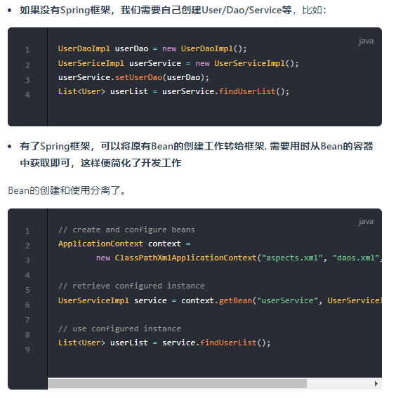

# Spring

从spring到springboot到springcloud微服务

[https://pdai.tech/md/spring/springboot/springboot-x-interface-exception.html](https://pdai.tech/md/spring/springboot/springboot-x-interface-exception.html)

**Spring**：IOC和AOP实现松耦合，通过IOC容器管理POJO对象以及他们之间的耦合关系；通过AOP以动态非侵入的方式增强服务

**IOC控制反转（又叫依赖注入 Dependency injection DI）**：

Spring框架管理这些Bean的创建工作，即由用户管理Bean转变为框架管理Bean，这个就叫**控制反转 - Inversion of Control (IoC)** Spring 框架托管创建的Bean放在哪里呢？ 这便是**IoC Container**; Spring 框架为了更好让用户配置Bean，必然会引入**不同方式来配置Bean？ 这便是xml配置，Java配置，注解配置**等支持

应用程序代码从Ioc Container中获取依赖的Bean，注入到应用程序中，这个过程叫 **依赖注入(Dependency Injection，DI)** ； 所以说控制反转是通过依赖注入实现的，其实它们是同一个概念的不同角度描述。通俗来说就是**IoC是设计思想，DI是实现方式** 在依赖注入时，有哪些方式呢？这就是构造器方式，@Autowired, @Resource, @Qualifier..

传统应用程序是由我们自己在对象中主动控制去直接获取依赖对象，也就是正转；而反转则是由容器来帮忙创建及注入依赖对象；为何是反转？因为由容器帮我们查找及注入依赖对象，对象只是被动的接受依赖对象



IOC的实现原理是简单工厂模式+单例模式+反射机制（详见设计模式-双重校验的单例模式，三级缓冲获取是否已有实例，提前暴露初始化实例来解决setter注入的循环依赖问题，反射使用jdk自带的以及cglib）

ApplicationContext和BeanFactory是两大核心接口，都可以当做spring的容器。

BeanFactory包含各种Bean的定义，读取bean配置文档，管理bean的加载、实例化，控制bean的生命周期，维护bean之间的依赖关系。而ApplicationContext是BeanFactory的子接口，还提供了更完整的框架功能：


BeanFactory默认是延迟加载，不能及时发现一些存在的Spring的配置问题，运行时第一次调用才能抛出异常

ApplicationContext在容器启动时，一次性创建了所有的Bean。这样，在容器启动时，我们就可以发现Spring中存在的配置错误，这样有利于检查所依赖属性是否注入

ApplicationContext中定义的refresh方法用于刷新整个容器，即重新加载/刷新所有的 bean，这在源码中到处都有用到

ApplicationContext 的初始化过程：

spring启动的时候就会调用refresh方法加载整个容器的bean

IOC容器懒加载：Bean是默认单例加载的（也可以设置为原型或者其他），并且在初始化时加载所有配置文件和注解的Bean。但如果bean过多的话，这种方式会使得容器启动方式缓慢，而且有些bean在容器中不会被使用到，所以产生懒加载（lazy-init）的概念，让某些bean延迟初始化的时机，在调用时才被初始化，只需要加@Lazy注解即可

****BeanDefinition****是Bean的前身。内部包含了初始化一个 Bean 的所有元信息，在 Spring 初始化一个 Bean 的过程中需要根据该对象生成一个 Bean 对象并进行一系列的初始化工作

常见的三种依赖注入方式：Field Setter 构造器

```java
// Field
@Controller 
public class HelloController {
    @Autowired
    private AlphaService alphaService;
    @Autowired
    private BetaService betaService;
}
```

```java
// Setter
@Controller
public class HelloController {
    private AlphaService alphaService;
    private BetaService betaService;
    
    @Autowired
    public void setAlphaService(AlphaService alphaService) {
        this.alphaService = alphaService;
    }
    @Autowired
    public void setBetaService(BetaService betaService) {
        this.betaService = betaService;
    }
}
```

```java
// Constructer
@Controller
public class HelloController {
		//构造器注入要用final修饰
    private final AlphaService alphaService;
    private final BetaService betaService;
    
    @Autowired
    public HelloController(AlphaService alphaService, BetaService betaService) {
        this.alphaService = alphaService;
        this.betaService = betaService;
    }
}
```

官方推荐强制依赖用构造器，非必需依赖用setter（setter可以方便的重新注入）

构造器注入通过final保证依赖不可变，并且因为是构造函数所以依赖不为空（否则会报错）。

还要就是循环依赖问题，构造器注入在启动时就会报错，但是field注入的话，启动不会报错，使用bean的时候才会报错。

**三级缓存不能解决构造器的循环依赖是因为在调用构造方法之前还未将其放入三级缓存之中**，因此后续的依赖调用构造方法的时候并不能从三级缓存中获取到依赖的Bean
不会缓存‘prototype’作用域的bean，所以不能解決原型模式的循环依赖


bean的作用域（bean在容器中的方式）


**单例bean不是线程安全的**，虽然它的创建过程是双重校验加锁，但是只保证了创建过程是线程安全，使用还是会有竞争，需要开发人员自己保证线程安全（最简单的就是用@scope设置为原型模式，觉得原型开销大就用ThreadLocal），但如果某个bean，调用它的操作不会对Bean的成员执行**「查询」**以外的操作，那么这个单例Bean是线程安全的。比如Spring mvc 的 Controller、Service、Dao等，这些Bean大多是无状态的，只关注于方法本身

Bean集合注入（List Map）：使用Autowired修饰一个List<XXXBean> 或者Map<String,XXXBean>， 会将容器中所有XXXBEAN的实现或子类都注入到这个List中，Map中的key是Bean的具体名字。用这个Map可以优雅的实现简单工厂模式+策略模式（工厂方法模式）

**Bean的生命周期（重点）**：

Spring 容器可以管理 singleton 作用域 Bean 的生命周期，在此作用域下，Spring 能够精确地知道该 Bean 何时被创建，何时初始化完成，以及何时被销毁。而对于 prototype 作用域的 Bean，Spring 只负责创建，当容器创建了 Bean 的实例后，Bean 的实例就交给客户端代码管理，Spring 容器将不再跟踪其生命周期。每次客户端请求 prototype 作用域的 Bean 时，Spring 容器都会创建一个新的实例，并且不会管那些被配置成 prototype 作用域的 Bean 的生命周期

实例化（使用反射调用bean的构造方法），属性赋值（属性和依赖），初始化（创建前 创建时 创建后），销毁


```java
// AbstractAutowireCapableBeanFactory.java
protected Object doCreateBean(final String beanName, final RootBeanDefinition mbd, final @Nullable Object[] args)
    throws BeanCreationException {

    // 1. 实例化
    BeanWrapper instanceWrapper = null;
    if (instanceWrapper == null) {
        instanceWrapper = createBeanInstance(beanName, mbd, args);
    }
    
    Object exposedObject = bean;
    try {
        // 2. 属性赋值
        populateBean(beanName, mbd, instanceWrapper);
        // 3. 初始化
        exposedObject = initializeBean(beanName, exposedObject, mbd);
    }

    // 4. 销毁-注册回调接口
    try {
        registerDisposableBeanIfNecessary(beanName, bean, mbd);
    }

    return exposedObject;
}
```

初始化：aware 接口的依赖注入、BeanPostProcessor 在初始化前后的处理以及 InitializingBean 和 init-method 的初始化操作（比如说数据库的bean，会在属性被填充后在初始化阶段调用扩展方法，使用这些属性初始化连接）

Aware接口可以让当前bean拿到spring容器的一些资源，比如name，classloader，ApplicationContext等（ApplicationContext可以让不交给容器管理的类模块（util包等）中通过名字、类等获得指定bean的实例和当前环境配置）

PostProcessor是初始化扩展最重要的接口，如果实现了这个接口，将调用该接口的预初始化方法 postProcessBeforeInitialzation() 对 Bean 进行加工操作。自动注入以及AOP的实现都和他有关


注册相关销毁回调接口，最后通过DisposableBean 和 destory-method 进行销毁。

详细流程：

将Bean的定义信息（例如**类名、scope、属性、构造函数参数列表、依赖的bean、是否是单例类、是否是懒加载**）存储到这个BeanDefinition相应的属性中，后面对Bean的操作就直接对BeanDefinition进行，拿到这个BeanDefinition后使用**反射进行对象创建**


自动装配&注入的相关注解：

@Bean 表示此方法将要返回一个对象，作为一个bean注册进Spring应用上下文

@Configuration 标记被注解的类内部包含一个或多个`@Bean`注解方法，容器会扫描这个类并将内部@Bean修饰的返回类加载到容器中

@Component 和Bean的区别在于修饰类，将这个类标记为bean加入到容器中

@Controller, @Repository, @Service本质都是component，只是命名特化

@Atuowired 可用于构造函数、成员变量、Setter方法。从容器中查看是否有这个类的实例，有的话就从容器中注入到当前属性

@Resource 本质和autowired相同，区别在于Autowired默认是按照类型装配注入的，Resource默认是按照名称来装配注入的，只有当找不到与名称匹配的bean才会按照类型来装配注入

@Qualifier 创建多个相同类型的 bean 并希望仅使用属性装配其中一个 bean 时 ，在autowired的基础上加qualifer根据命名选择bean

@RequestMapping将http请求映射到MVC 和 REST 控制器的处理方法(可以用具体的getmapping postmapping等代替)

```java
@RestController
@RequestMapping("/home ")
public class IndexController {
    @RequestMapping("/ ")
    String get() {
        //mapped to hostname:port/home/
        return "Hello from get ";
    }
    @RequestMapping("/index ")
    String index() {
        //mapped to hostname:port/home/index/
        return "Hello from index ";
    }
}
```

**AOP面向切面编程**：

[https://juejin.cn/post/6844903856778772494](https://juejin.cn/post/6844903856778772494)

[https://juejin.cn/post/6844903860666908685](https://juejin.cn/post/6844903860666908685)

Spring 框架通过定义切面, 通过拦截切点实现了不同业务模块的解耦。基于动态代理技术实现了AOP，动态代理又是基于反射。

通过AbstractAspectJAdvice拦截所有类的创建找出符合条件的bean创建动态代理执行增强操作

**AspectJ是静态代理的增强（修改目标类的字节，织入代理的字节，在程序编译的时候 插入动态代理的字节码，不会生成全新的Class ）**，Spring AOP使用的是动态代理

将那些与业务无关，但却对多个对象产生影响的公共行为和逻辑，抽取并封装为一个可重用的模块，这个模块被命名为“切面”（Aspect），减少系统中的重复代码，降低了模块间的耦合度，同时提高了系统的可维护性。可用于权限认证、日志、事务处理等

用@Aspect标记该类是一个切面处理类，用@pointcut定义需要切的位置，支持多种粒度的切面，在范围内的所有被装配的bean都会被织入切面


**Springboot：**

 基于约定优于配置的思想，去除了Spring的手动Xml配置，用spring-boot-starter-xx 启动器简化使用各个库的流程，总结下来就是快速开发的Spring框架。

 比Spirng有一定增强：提供了一系列大型项目通用的非业务性功能，例如：**内置了tomcat服务器**、安全管理、运行数据监控、运行状况检查和外部化配置等

核心注解是@SpringBootApplication，包含以下注解


默认使用Logback作为日志框架

**Spring-boot-starter-xx启动器的原理**：@SpringBootApplication注解会自动去maven中读取每个starter中的spring.factories文件,该文件里配置了所有需要被创建spring容器中的bean，并且进行自动配置把bean注入SpringContext中

SpringBoot事务使用**：**首先使用注解EnableTransactionManagement开启事物之后，然后在Service方法上添加注解Transactional便可

Springboot异步调用：在方法上使用@Async注解即可实现方法的异步调用。 注意：需要在启动类加入@EnableAsync使异步调用@Async注解生效

springboot配置文件的读取：配置写在application.yaml里，需要读取配置的变量使用@value注解修饰

自动配置：@EnableAutoConfiguration开启后会去配置文件Spring.factories加载可能用到的自动配置类

Yaml是JSON的超集，yaml用缩进来定义结构化数据，配置文件都很常用，yaml在springboot更多一点，数据传输一般都用json

跨域问题：实现WebMvcConfigurer接口重写addCorsMappings方法解决跨域问题

```java
@Configuration
  public class CorsConfig implements WebMvcConfigurer {

      @Override
      public void addCorsMappings(CorsRegistry registry) {
          registry.addMapping("/**")
                  .allowedOrigins("*")
                  .allowCredentials(true)
                  .allowedMethods("GET", "POST", "PUT", "DELETE", "OPTIONS")
                  .maxAge(3600);
      }

  }
```

**拦截器  实现HandlerInterceptor**接口进行pre post处理，还需要有一个拦截器配置类继承WebMvcConfigurerAdapter，对于每个实现HandlerInterceptor接口的类 指定需要拦截的路径（涉及到反射，没有涉及到动态代理）


**@ControlerAdvice注解**：增强的Controller，可以对全局生效实现统一的控制

`@ControllerAdvice`是一个`@Component`，用于定义`@ExceptionHandler`，`@InitBinder`和`@ModelAttribute`方法，适用于所有使用`@RequestMapping`的方法

@ControlerAdvice+@exceptionhandler 实现全局异常处理

```java
@ControllerAdvice
public class MyGlobalExceptionHandler {
    @ExceptionHandler(Exception.class)
    public ModelAndView customException(Exception e) {
        ModelAndView mv = new ModelAndView();
        mv.addObject("message", e.getMessage());
        mv.setViewName("myerror");
        return mv;
    }
}

```

@ControlerAdvice+requestbodyadviceadapter拦截请求，可以校验入参，也可以处理入参的解密，或者记录日志。比拦截器要优雅。结合reponsebodyadvice

可以对接口返回数据进行同样的处理

分布式session共享：Spring Session + Redis 来实现 session 共享。将所有微服务的 session 统一保存在 Redis 上，当各个微服务对 session 有相关的读写操作时，都去操作 Redis 上的 session 。这样就实现了 session 共享，Spring Session 基于 Spring 中的代理过滤器实现，使得 session 的同步操作对开发人员而言是透明的

定时任务：@Scheduled 或者Quartz，自己写也可以用阻塞队列或延迟队列

**SpringCloud**：关注全局的微服务协调整理治理框架

基于SpringBoot把市场上优秀的服务框架组合起来，通过Spring Boot风格进行再封装屏蔽掉了复杂的配置和实现原理

引入了重要的组件：

Eureka服务注册与发现，Zuul服务网关，Config分布式统一配置管理

 Eureka作为SpringCloud的服务注册功能服务器，他是服务注册中心，系统中的其他服务使用Eureka的客户端将其连接到Eureka Service中，并且保持心跳，这样工作人员可以通过Eureka Service来监控各个微服务是否运行正常。

Zuul是对SpringCloud提供的成熟对的路由方案，他会根据请求的路径不同，网关会定位到指定的微服务，并代理请求到不同的微服务接口，他对外隐蔽了微服务的真正接口地址

Zuul是java语言实现的，主要为java服务提供网关服务，尤其在微服务架构中可以更加灵活的对网关进行操作。Nginx是使用C语言实现，性能高于Zuul，但是实现自定义操作需要熟悉lua语言，对程序员要求较高，可以使用Nginx做Zuul集群

官方现在推荐使用SpringCloud Gateway来替代Zuul

雪崩效应是在大型互联网项目中，当某个服务发生宕机时，调用这个服务的其他服务也会发生宕机，大型项目的微服务之间的调用是互通的，这样就会将服务的不可用逐步扩大到各个其他服务中，从而使整个项目的服务宕机崩溃

**服务降级、熔断、服务隔离：**

服务降级：服务降级是从整个系统的负荷情况出发和考虑的，对某些负荷会比较高的情况，为了预防某些功能（业务场景）出现负荷过载或者响应慢的情况，在其内部暂时舍弃对一些非核心的接口和数据的请求，而直接返回一个提前准备好的fallback（退路）错误处理信息。这样，虽然提供的是一个有损的服务，但却保证了整个系统的稳定性和可用性

服务熔断是在服务降级的基础上更直接的一种保护方式，当在一个统计时间范围内的请求失败数量达到设定值（requestVolumeThreshold）或当前的请求错误率达到设定的错误率阈值（errorThresholdPercentage）时开启断路，之后的请求直接走fallback方法，快速返回错误的信息，在设定时间（sleepWindowInMilliseconds）后尝试恢复。

服务隔离就是Hystrix为隔离的服务开启一个独立的线程池，这样在高并发的情况下不会影响其他服务。服务隔离有线程池和信号量两种实现方式，一般使用线程池方式。

- 触发原因不一样，服务熔断由链路上某个服务引起的，服务降级是从整体的负载考虑
- 管理目标层次不一样，服务熔断是一个框架层次的处理，服务降级是业务层次的处理
    - 实现方式不一样，服务熔断一般是自我熔断恢复，服务降级相当于人工控制
- 触发原因不同 服务熔断一般是某个服务（下游服务）故障引起，而服务降级一般是从整体负荷考虑；