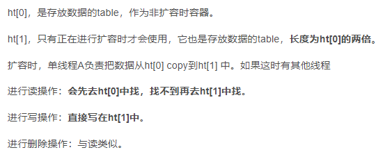

# 中间件

工作中如何使用redis ES和kafka的：

**Redis**：Redis入门指南 **[Redis实战](https://book.douban.com/review/9637142/)**

java客户端Redisson

优势：

1. 支持10w/s读写
2. 所有操作自带原子性，还支持对操作合并后的原子性执行
3. 丰富强大的数据类型
4. 成熟的持久化 RDB AOF
5. 支持发布订阅模式
6. 支持分布式 Redis Cluster

常见应用：高读写实现热点数据缓存；expire设置过期时间可以用在限时优惠、验证码等业务场景；原子性的操作用于计数器相关场景（高并发秒杀，分布式序列号生成...）；stenx命令实现分布式锁（也是用在秒杀系统中）；sortedSet可以实现排行榜相关场景；集合的一些命令可以实现朋友圈/Feed流系统中点赞、好友等相互关系；订阅功能可以实现订单失效时间等延时操作。

基础数据类型：[https://pdai.tech/md/db/nosql-redis/db-redis-data-types.html](https://pdai.tech/md/db/nosql-redis/db-redis-data-types.html)

String字符串 key-value：可以用作缓存，INCR和DECR操作可以用于计数器

List双向链表：可以用于朋友圈/微博的timeline功能，还有消息队列

Set集合（String类型的无序集合）：通过哈希表实现，增删查复杂度都是o(1)；可以用于标签，点赞，收藏等功能

Hash表：缓存，和String的区别：建议是大部分情况下使用 String 存储就好，毕竟在存储具有多层嵌套的对象时方便很多，占用的空间也比 Hash 小。当我们需要存储一个特别大的对象时，而且在大多数情况中**只需要访问该对象少量的字段**时，可以考虑使用 Hash

Zset有序集合：和集合实现一样也是 string 类型元素的集合,通过哈希表实现，不允许重复的成员。不同的是每个元素都会关联一个 double 类型的分数。redis 正是通过分数来为集合中的成员进行从小到大的排序；**数据少时用ziplist，数据量大用hash加skiplist**，用于排行榜。

特殊数据类型：

HyperLogLogs基数统计：省内存的进行大数据计数，但是有0.81%的错误率

Bitmap位图：省内存

geospatial地理位置（实现原理Zset）：计算两地之间的距离, 方圆几里的人

redis5.0新增了一个Stream类型，鉴了Kafka的设计，是一个新的强大的支持多播的可持久化的消息队列。旧版本redis实现消息队列的方式有订阅/发布模式和基于List，但是支持方式都有缺陷。

底层数据结构类型：

1.Sds简单字符串

2.ZipList压缩列表：为了提高存储效率而设计的一种特殊编码的双向链表。它可以存储字符串或者整数，存储整数时是采用整数的二进制而不是字符串形式存储

3.QuickList快表：以zipist为节点的双端链表。list作为最传统的双链表, 结点通过指针持有数据, 指针字段会耗费大量内存. ziplist解决了耗费内存这个问题. 但引入了新的问题: 每次写操作整个ziplist的内存都需要重分配. quicklist在两者之间做了一个平衡.

4.Dict哈希表：渐进式Hash-扩容和收缩操作不是一次性、集中式完成的，而是分多次、渐进式完成的。如果保存在Redis中的键值对只有几个几十个，那么 rehash 操作可以瞬间完成，但是如果键值对有几百万，几千万甚至几亿，那么要一次性的进行 rehash，势必会造成Redis一段时间内不能进行别的操作。所以Redis采用渐进式 rehash,这样在进行渐进式rehash期间，字典的删除查找更新等操作可能会在两个哈希表上进行，第一个哈希表没有找到，就会去第二个哈希表上进行查找。但是进行 增加操作，一定是在新的哈希表上进行的。

5.Inset整数集：实现set

6.**ZSkipList跳表**：作为有序集合 (Zset) 的实现。跳跃表的性能可以保证在查找，删除，添加等操作的时候在对数期望时间内完成，这个性能是可以和平衡树来相比较的，而且在实现方面比平衡树要优雅，这就是跳跃表的长处。跳跃表的缺点就是需要的存储空间比较大，属于利用空间来换取时间的数据结构

**为什么用跳表不用平衡树或者哈希表**：作者的注释是说实现简单且达到了类似效果。

跳表每插入一个新元素，一直抛硬币，是正面就累加，反面的时候停止，最后记录的次数作为该元素的最高层（具体实现可见[https://leetcode-cn.com/problems/design-skiplist/solution/javashou-xie-shi-xian-tiao-biao-by-feng-omdm0/](https://leetcode-cn.com/problems/design-skiplist/solution/javashou-xie-shi-xian-tiao-biao-by-feng-omdm0/)）

**持久化-RDB和AOF机制**：

Redis是个基于内存的数据库。那服务一旦宕机，内存中的数据将全部丢失。通常的解决方案是从后端数据库恢复这些数据，但后端数据库有性能瓶颈，如果是大数据量的恢复，1、会对数据库带来巨大的压力，2、数据库的性能不如Redis。导致程序响应慢。所以对Redis来说，实现数据的持久化，避免从后端数据库中恢复数据，是至关重要的。

RDB 就是 Redis DataBase 的缩写，中文名为快照/内存快照，RDB持久化是把当前进程数据生成快照保存到磁盘上的过程，由于是某一时刻的快照，那么快照中的值要早于或者等于内存中的值。

主进程为了在这个过程中继续服务，调用fork函数（重操作）产生一个子进程，子进程负责持久化的过程，主进程继续负责提供服务。通过fork函数创建子进程后，父子进程共享同一份数据，子进程初始不复制数据，数据只在要写的时候才会进行复制-在RDB的过程中如果修改某一个数据，这块数据就会被复制一份，生成该数据的副本。然后，子进程会把这个副本数据写入 RDB 文件，而在这个过程中，主线程仍然可以直接修改原来的数据。这样保证了快照保存的只是那一刻的数据，之后的修改不会在快照中体现（Copy-on-write）。

RDB分手动触发和自动触发两种：手动触发指令save和bgsave，自动触发有几种情况：redis.conf中配置快照周期`save m n`，即在m秒内有n次修改时，自动触发bgsave；主从复制时，从节点要从主节点进行全量复制时也会触发bgsave操作

****RDB优缺点：****

**优点** 
• RDB文件是某个时间节点的快照，默认使用LZF算法进行压缩，压缩后的文件体积远远小于内存大小，适用于备份、全量复制等场景； 
• Redis加载RDB文件恢复数据要远远快于AOF方式；

 **缺点** 
• RDB方式实时性不够，无法做到秒级的持久化； 
• 每次调用bgsave都需要fork子进程，fork子进程属于重量级操作，频繁执行成本较高； 
• RDB文件是二进制的，没有可读性，AOF文件在了解其结构的情况下可以手动修改或者补全； 
• 版本兼容RDB文件问题；

AOF需要设置打开，AOF日志采用写后日志，即先写内存，后写日志，像mysql使用的是写前日志

为什么redis用写后日志：要求高性能，避免额外的检查开销 Redis 在向 AOF 里面记录日志的时候，并不会先去对这些命令进行语法检查，也不会阻塞写操作。

风险在于如果命令执行完成，写日志之前宕机了，会丢失数据。

AOF何时将缓冲区中内容写入AOF文件中有三种策略：

AOF会记录每个写命令到AOF文件，随着时间越来越长，AOF文件会变得越来越大。如果不加以控制，会对Redis服务器，甚至对操作系统造成影响，而且AOF文件越大，数据恢复也越慢。提供了AOF文件重写机制：通过创建一个新的AOF文件来替换现有的AOF，新旧两个AOF文件保存的数据相同，但新AOF文件没有了冗余命令。主线程fork出子进程重写aof日志，子进程重写日志完成后，主线程追加aof日志缓冲，替换日志文件。

**RDB和AOF混合使用**：内存快照以一定的频率执行，在两次快照之间，使用 AOF 日志记录这期间的所有命令操作。

这样一来，快照不用很频繁地执行，这就避免了频繁 fork 对主线程的影响。而且，AOF 日志也只用记录两次快照间的操作，也就是说，不需要记录所有操作了，因此，就不会出现文件过大的情况了，也可以避免重写开销

发布/订阅模式：SUBSCRIBE 命令可以让客户端订阅任意数量的频道， 每当有新信息发送到被订阅的频道时， 信息就会被发送给所有订阅指定频道的客户端

当有新消息通过 PUBLISH 命令发送给频道 channel1 时， 这个消息就会被发送给订阅它的三个客户端

Redis事务：Redis 事务的本质是一组命令的集合。事务支持一次执行多个命令，一个事务中所有命令都会被序列化。在事务执行过程，会按照顺序串行化执行队列中的命令，其他客户端提交的命令请求不会插入到事务执行命令序列中。总结说：redis事务就是一次性、顺序性、排他性的执行一个队列中的一系列命令

Watch操作可以实现乐观锁：如果在 WATCH 执行之后， EXEC 执行之前， 有其他客户端修改了 mykey 的值， 那么当前客户端的事务就会失败。 程序需要做的， 就是不断重试这个操作， 直到没有发生碰撞为止。这种形式的锁被称作乐观锁， 它是一种非常强大的锁机制。 并且因为大多数情况下， 不同的客户端会访问不同的键， 碰撞的情况一般都很少， 所以通常并不需要进行重试。

Redis不支持回滚是因为本身就是单线程，原子性的，事务发生错误是因为错误的语法，所以不需要回滚

Redis为什么使用单线程：

Redis运行在内存中，读写速度很快，而多线程上下文切换的时间消耗相较而言就比较明显，使用单线程可以减少上下文切换的时间消耗。此外，Redis的性能瓶颈在于内存大小以及网络带宽，不在cpu。简单易行，指令串行，不用维护复杂的锁机制，避免资源竞争。同时避免了不必要的上下文切换，减少了CPU消耗。单线程天生支持原子性，在处理并发时逻辑非常简单。

Redis支持ACID吗:首先原子性是支持的，不论是单个操作还是事务。一致性和隔离性也是有的，但是redis事务不保证持久性，这是因为redis持久化策略中不管是RDB还是AOF都是异步执行的，不保证持久性是出于对性能的考虑

Redis的主从复制：

**主从复制的作用**主要包括：

- **数据冗余**：主从复制实现了数据的热备份，是持久化之外的一种数据冗余方式。
- **故障恢复**：当主节点出现问题时，可以由从节点提供服务，实现快速的故障恢复；实际上是一种服务的冗余。
- **负载均衡**：在主从复制的基础上，配合读写分离，可以由主节点提供写服务，由从节点提供读服务（即写Redis数据时应用连接主节点，读Redis数据时应用连接从节点），分担服务器负载；尤其是在写少读多的场景下，通过多个从节点分担读负载，可以大大提高Redis服务器的并发量。
- **高可用基石**：除了上述作用以外，主从复制还是哨兵和集群能够实施的基础，因此说主从复制是Redis高可用的基础

全量复制：

增量复制：连接断开后会采用增量复制的方式同步

哨兵机制：主节点的自动故障转移-sentinel系统可以监视一个或者多个redis master服务，以及这些master服务的所有从服务；当某个master服务下线时，自动将该master下的某个从服务升级为master服务替代已下线的master服务继续处理请求

哨兵的选举机制其实很简单，就是一个Raft选举算法： 选举的票数大于等于num(sentinels)/2+1时，将成为领导者，如果没有超过，继续选举

Redis的部署模式：

1. 主从模式

将数据库分为主数据库和从数据库，其中主数据库一般负责写，而从数据库一般负责读，实现读写分离

原理：

- 主数据库正常配置
- 在从数据库中配置跟随的主数据库
- 主数据库收到sync指令后，通过RDB快照当前数据库，结束后发送给从服务器
- 所有的写操作都通过主数据库，然后通过异步方式向从数据库推送增量数据
- 大部分的读操作都通过从数据库
- 主数据库的写入操作和与从数据库的同步是异步进行

优点：可以合理搭配主从数据库的数量将负载有效的分担到不同配置的服务器中。缺点：由于数据库读写是在不同的数据库中异步实现，因此存在数据不同步的可能性

 2. 哨兵模式

对于一主多从的数据库模式，如果主数据库崩溃，则数据库服务中断。有了哨兵模式后，若主数据库崩溃，则可以通过哨兵监控，将从服务器转化为主服务器，哨兵之间也能相互监控。Redis-sentinel本身是一个独立运行的进程，能够监控多个master-slave集群，发现master宕机后能够进行切换

1. 集群模式

随业务量和数据量的增加，redis性能到达单节点瓶颈，垂直扩容（提升各节点自身的性能，如增加节点的储存空间）受到机器性能限制，而水平扩容（增加节点数量）涉及到对应用的影响以及数据迁移中的丢失风险。集群模式正是可以解决这些问题，用于实现负载均衡，集群模式主要可以解决分片问题，将整个数据按照规则分布在不同的子节点上，每个节点负责自己部分的数据。

Redis缓存相关问题：

缓存穿透 缓存穿击 缓存雪崩 缓存污染 缓存和数据库一致性

缓存穿透：请求缓存和数据库中都没有的数据，每一次都会去查询db。 比如攻击者发起查找id为-1的数据，每次请求都在db上。

解决办法：布隆过滤器快速判断数据库中是否有，没有则直接返回；或者接口层添加校验。

缓存击穿：访问非常频繁的热点数据过期失效-请求缓存中没有但数据库中有的高频热点数据，如果此时访问这条数据的并发特别多，一起访问db就会造成崩溃

解决方法：设置热点数据永不过期；接口限流和降级熔断-当服务down掉后，进行熔断，快速返回。

缓存雪崩：缓存中数据大批量到过期时间，而查询数据量巨大，引起数据库压力过大甚至down机；和击穿的区别在于缓存击穿指并发查同一条数据，缓存雪崩是不同数据都过期了，很多数据都查不到从而查数据库

解决方法：过期时间加一个随机数，防止大量数据同一时间同时过期（削峰）；设置热点数据永不过期

缓存污染：缓存中一些只会被访问一次或者几次的的数据，被访问完后，再也不会被访问到，但这部分数据依然留存在缓存中，消耗缓存空间

解决方法：缓存淘汰策略-对设置了过期时间的数据或者全部数据使用random，lru，lfu算法。 redis的lru算法进行了优化：会随机选出 N 个数据，把它们作为一个候选集合。接下来，Redis 会比较这 N 个数据的 lru 字段，把 lru 字段值最小的数据从缓存中淘汰出去。通过随机读取待删除集合，可以让Redis不用维护一个巨大的链表，也不用操作链表，进而提升性能

Redis的过期删除策略：过期删除策略主要分为三种：定时删除、惰性删除以及定期删除

1. 定时删除

定时删除时设置某个key的过期时间，一旦过期则立即执行删除操作，优点是节约内存，缺点是消耗cpu资源

1. 惰性删除

惰性删除是指设置某个key的过期时间后，只有在下次使用它时才去检查其是否过期，若过期则删除，优点是十分节省CPU资源，缺点是是非常占用内存资源，可能会延迟删除许多key，甚至永远无法删除一些之后不会用到的key

1. 定期删除

设置key的过期时间后，每隔一段时间检查是否过期，并统一删除过期key，通过合理设置时间可以较好的综合CPU与内存资源，但是存在致命缺点：某个key删除后但并未到定期删除的时间，下次查询就仍然会返回。

可见，上述过期删除策略都存在各自的优点和缺陷，单一策略的使用难以满足实际需要。因此Redis采用的是惰性删除与定期删除搭配使用的过期删除策略。可以理解为在惰性删除的基础上，每隔一段时间，**随机**从一定数量的数据库随机抽取一定数量的key进行检查，并清理过期键。随机抽取的策略进一步减少了对CPU资源的依赖，同时也较好的平衡了对内存资源的消耗。

## **Redis的内存淘汰机制**

**写操作的缓存一致性问题**

- 更新缓存or直接淘汰缓存
- 先更新缓存or先更新数据库

对于第一个问题：若直接将旧数据从缓存中淘汰，操作十分简单，但下次查询到该数据时会有一次缓存未命中。而更新缓存的话，若数据较为复杂，则存在多次缓存与数据库的交互，整体消耗大，另外多个线程更新缓存也存在先后性的问题，比较麻烦。相比较而言，直接从缓存中淘汰旧数据，操作简单，而且最多带来一次缓存未命中的问题，更加具有优势

对于第二个问题：

考虑先淘汰缓存，然后更新数据库：若采用同步更新缓存的策略，在高并发情况下，若某个线程先淘汰了缓存而数据库还未更新，此时另外一个线程到数据库中读取该数据并读入缓存，此时缓存中数据与数据库数据不一致，并且直到该数据下一次被更新均不一致，会带来很长时间的不一致问题。

解决办法：1. 高并发情况下，采用异步更新策略，某个线程进行写操作，先淘汰缓存，此时其它线程读取该数据只从数据库中读而不放入缓存，等到进行写操作的线程成功更新数据库后，通过订阅binlog来异步更新缓存

2. 若采取同步更新缓存策略，为解决长时间不一致问题，可以采用串行化或者是延时双删策略，写数据进程在完成数据库的更新后，休眠M秒后再次尝试淘汰缓存。延时双删一个是会降低更新操作的吞吐量，另一个是若二次缓存淘汰失败，还会造成长时间的不一致问题，因此还需要引入重试机制，即当二次淘汰失败，报错并继续重试，直至执行成功。

考虑先更新数据库，再淘汰缓存更新数据库到淘汰缓存的时间段内，数据库和缓存中的数据不一致，会造成短时间的数据不一致问题，但是此时读取效率高，此外引入重试机制可以防止淘汰缓存失败导致的数据长时间不一致问题，适用于对一致性要求不是很高的业务。

小结：

- 淘汰缓存而不是更新缓存
- 若先淘汰缓存再更新数据库，同步更新缓存策略下存在数据长时间不一致的问题，可以采用串行化或者延时双删等策略，读取效率相对高，数据一致性需要另外保证。异步更新缓存策略下，数据始终一致，但是更新时其它线程都需要到数据库中读取数据，效率低（数据一致性高，适用于对一致性要求高的业务）
- 先更新数据库再淘汰缓存，效率高，数据一段时间不一致，（适用于对一致性要求不太高的业务）

不论是先写db再写缓存还是先写缓存再写db都会出现一致性问题：

1.如果删除了缓存Redis，还没有来得及写库MySQL，另一个线程就来读取，发现缓存为空，则去数据库中读取数据写入缓存，此时缓存中为脏数据。

2.如果先写了库，在删除缓存前，写库的线程宕机了，没有删除掉缓存，则也会出现数据不一致情况。

解决方法：

最常用的Cache Aside模式：

- **失效**：应用程序先从cache取数据，没有得到，则从数据库中取数据，成功后，放到缓存中。
- **命中**：应用程序从cache中取数据，取到后返回。
- **更新**：先把数据存到数据库中，成功后，再让缓存失效（为什么不更新缓存：防止两个并发的写导致脏数据）

脏读情况：一个是读操作，但是没有命中缓存，然后就到数据库中取数据，此时来了一个写操作，写完数据库后，让缓存失效，然后，之前的那个读操作再把老的数据放进去，所以，会造成脏数据。

这个case理论上会出现，不过，实际上出现的概率可能非常低，因为这个条件需要发生在读缓存时缓存失效，而且并发着有一个写操作。而实际上数据库的写操作会比读操作慢得多，而且还要锁表，而读操作必需在写操作前进入数据库操作，而又要晚于写操作更新缓存。所以Facebook使用了这个降低概率的方法，因为严格保持一致性的方法中2PC太慢，而Paxos太复杂

还有一种方法，在数据库写完后，将需要删除的key发送到消息队列，redis消费消息来进行删除操作。对业务线代码造成大量的侵入。所以还有一种优化：不用消息队列，redis订阅数据库的binlog，通过binlog进行删除操作，类似于数据库的主从复制

redis和memcached的区别：

1.memcached只支持key-value，redis有更多的数据结构，除了缓存外的更多功能

2.redis只用单核单线程，memcached可以多核多线程

3.memcached本身不支持分布式，redis支持

4.memchaed没有持久化

5.redis不是纯内存，当物理内存用完时，可以将一些很久没用到的value 交换到磁盘

redis面试问题总结（进阶版）：[https://pdai.tech/md/db/nosql-redis/db-redis-z-mianshi.html](https://pdai.tech/md/db/nosql-redis/db-redis-z-mianshi.html)

**ElasticSearch:**

数据检索，聚合查询，搜索引擎，准实时查询。

基于Lucene（高性能、全功能的搜索引擎库）的倒排索引，但是隐藏 Lucene 的复杂性，取而代之提供一套简单一致的 RESTful API。

所以采用以往的模糊查询，模糊查询前置配置，会放弃索引，导致商品查询是全表扫面，在百万级别的数据库中，效率非常低下，而我们使用ES做一个全文索引，我们将经常查询的商品的某些字段，比如说商品名，描述、价格还有id这些字段我们放入我们索引库里，可以提高查询速度

1）海量数据的分布式存储以及集群管理，达到了服务与数据的高可用以及水平扩展；

2）近实时搜索，性能卓越。对结构化、全文、地理位置等类型数据的处理；

3）海量数据的近实时分析（聚合功能）应用场景：

1）网站搜索、垂直搜索、代码搜索；

2）日志管理与分析、安全指标监控、应用性能监控、Web抓取舆情分析；

**为什么叫准实时**？对 Elasticsearch 的写入操作成功后，写入的数据需要1秒钟后才能被搜索到，因此 Elasticsearch 搜索是准实时或者又称为近实时.

当写请求发送到 es 后，es 将数据暂时写入 `memory buffer` 中，此时写入的数据还不能被查询到。默认设置下，es 每1秒钟将 `memory buffer` 中的数据 `refresh` 到 Linux 的 `File system cache`，并清空 `memory buffer`，此时写入的数据就可以被查询到了。

但 `File system cache` 依然是内存数据，一旦断电，则 `File system cache` 中的数据全部丢失。默认设置下，es 每30分钟调用 `fsync` 将 `File system cache` 中的数据 `flush` 到硬盘。因此需要通过 `translog` 来保证即使因为断电 `File system cache` 数据丢失，es 重启后也能通过日志回放找回丢失的数据。

es和数据库的对比：6.0.0版本开始一个索引只存储一类数据，所以type被废弃

一般使用java High Level REST Client，把底层DSL语句基于设计模式进行了封装，像mybatis-plus一样调用：wrapperQuery-建造者模式

**ES原理**：[https://blog.csdn.net/qq_36289377/article/details/82993160](https://blog.csdn.net/qq_36289377/article/details/82993160)

value-key形式的倒排索引

可以看到，倒排索引是针对每个字段的，每个字段都有自己的倒排索引，25、32这些叫做term，[1,3]这种叫做posting list（倒排链表）。

ES使用FST快速查找&压缩技术将Term index（前缀树 AKA 字典树）存到内存中，在内存中直接索引term所在的磁盘block，再去磁盘读取term，找到对应的posting list

FST：

1、空间占用小。通过对词典中单词前缀和后缀的重复利用，压缩了存储空间；

2、查询速度快。O(len(str))的查询时间复杂度。

当一个term对应的posting list特别大的时候，存储空间要求特别大，内存装不下怎么办：

初步解决方案-bitmap

但是bitmap压缩也不够用，咋办呢

引入优化版bitmap - 增量bitmap

首先排序，然后将最小数后面的大数都优化为增量的小数（227=300-73),然后转换成二进制，取占最大位的数，227占8位，前三个占八位，30占五位，后三个数每个占五位

但是增量bitmap也只是进行了线性压缩，极端情况下还是不够用

引入终极版本-Roaring Bitmap

除数分块，避免[1,99999989,....,99999999]这种特殊情况

以65535模分块（2^16-1，两个字节能表示的最大数）

如果某一个块里面的值个数小于4096，就用short的array来存，如果大于就用bitmap存（为什么是4096：固定每块内存65535 bit，这种情况下，short最多存4096个数，因此整数基数较小时，使用数组更省空间，基数较大时，使用bitmap更省空间）

使用roaring bitmap实现了将大posting list装进内存中

es聚合（联合索引）查询：[https://www.cnblogs.com/bonelee/p/6394451.html](https://www.cnblogs.com/bonelee/p/6394451.html)

如果查询的filter缓存到了内存中（以bitset的形式），那么合并就是两个bitmap的AND。如果查询的filter没有缓存，那么就用skip list的方式去用类多路归并的方式找两个在磁盘上的posting list的交集，

 `*suffix -> xiffus*` 如果我们想以后缀作为搜索条件，可以为Term做反向处理

Kafka

削峰平谷