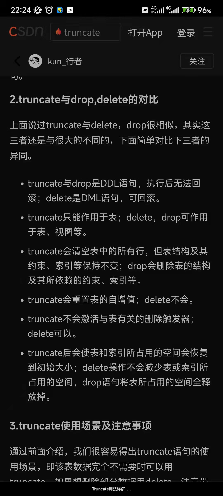

# 数据库mysql

`高性能MySQL`

超键、候选键、主键：

**超键(**super key):在关系中能唯一标识[元组](https://so.csdn.net/so/search?q=%E5%85%83%E7%BB%84&spm=1001.2101.3001.7020)的属性集称为关系模式的超键

**候选键**(candidate key):不含有多余属性的超键称为候选键

**主键(**primary key):用户选作元组标识的一个候选键程序[主键](https://so.csdn.net/so/search?q=%E4%B8%BB%E9%94%AE&spm=1001.2101.3001.7020)

（java开发手册：1.不得使用外键与级联更新，一切外键概念必须在应用层解决

2.存储过程有点像数据库里的函数，预编译一次后可以直接执行，但是开发手册禁止使用存储过程，难以调试和扩展，且没有移植性）

Mysql数据存储类型：

整形：TINYINT,SMALLINT,MEDIUMINT,INT,BIGINT

浮点数：FLOAT,DOUBLE,DECIMAL

字符串：CHAR、VARCHAR，VARCHAR是变长的，能够节省空间，只需要存储必要的内容。但是在执行 UPDATE 时可能会使行变得比原来长，当超出一个页所能容纳的大小时，就要执行额外的操作。MyISAM 会将行拆成不同的片段存储，而 InnoDB 则需要分裂页来使行放进页内。VARCHAR 会保留字符串末尾的空格，而 CHAR 会删除。

些情况使用VARCHAR是合适的：字符串的最大长度比平均长度大很多；列的更新很少，所以碎片不是问题；使用了像UTF-8这样复杂的字符集，每个字符都使用不同的字节数进行存储。CHAR适合存储很短的字符串，或者所有值都接近同一个长度，如密码的MD5值。对于经常变更的数据，CHAR也比VARCHAR更好，因为CHAR不容易产生碎片

VARCHAR(5)和VARCHAR(200)存储"hello"的空间开销是一样的。那么使用更短的列有什么优势吗？更长的列会消耗更多的内存，因为MySQL通常会分配固定大小的内存块来保存内部值。尤其是使用内存临时表进行排序或其他操作时会特别糟糕。在利用磁盘临时表进行排序时也同样糟糕。

日期类型：DATETIME 和 TIMESTAMP，**DATETIME和时区无关，TIMESTAMP和时区有关**，也就是说一个时间戳在不同的时区所代表的具体时间是不同的。应该尽量使用 **TIMESTAMP**，因为它比 DATETIME 空间效率更高。

大类型数据：BLOB和TEXT都是为存储很大的数据而设计的数据类型，分别采用二进制和字符方式存储。MySQL对BLOB和TEXT列进行排序与其他类型是不同的：它只对每个列的最前max_sort_length个字节而不是整个字符串做排序。同样的，MySQL也不能将BLOB或TEXT列全部长度的字符串进行索引

尽量选择更小的数据类型，索引尽量避免NULL：**可为NULL 的列使得索引、索引统计和值比较、扫描都更复杂**。尽管把可为NULL的列改为NOT NULL带来的性能提升比较小，但如果计划在列上创建索引，就应该尽量避免设计成可为NULL的列（主键不能为null，主键索引也不能有null）

内连接，自然连接，外连接：[https://www.cnblogs.com/isalo/p/15384186.html](https://www.cnblogs.com/isalo/p/15384186.html)

join就是inner join，而且等价于where a.x=b.y，不会消除重复列。自然连接会消除重复列，不需要指定where

Select …… from 表1 （inner） join 表 2 on 表1.A=表2.E

等价于Select a.*,b.* from a,b where a.x = b.y

事务的ACID：

 **1. 原子性(Atomicity)**

事务被视为不可分割的最小单元，事务的所有操作要么全部提交成功，要么全部失败回滚。

回滚可以用日志来实现，日志记录着事务所执行的修改操作，在回滚时反向执行这些修改操作即可。

**2. 一致性(Consistency)**

**数据库在事务执行前后都保持一致性状态**。在一致性状态下，所有事务对一个数据的读取结果都是相同的。

3. **隔离性(Isolation)** 

**一个事务所做的修改在最终提交以前，对其它事务是不可见的。一个用户的事务不被其他事务所干扰，各并发事务之间数据库是独立的**

4**. 持久性(Durability)**

一旦事务提交，则其所做的修改将会永远保存到数据库中。即使系统发生崩溃，事务执行的结果也不能丢失。可以通过数据库备份和恢复来实现，在系统发生崩溃时，使用备份的数据库进行数据恢复。

MySQL 默认采用自动提交模式。也就是说，如果不显式使用`START TRANSACTION`
语句来开始一个事务，那么每个查询都会被当做一个事务自动提交

**数据库的并发一致性问题（丢失了隔离性）**：

丢失修改：1先改，2再改，2的修改覆盖了1的修改

脏读： **1修改了数据，2读取这个数据，之后1撤销了修改，2读的就是脏数据**

不可重复读：2读取数据，1之后对数据进行了修改，2再次读取发现和第一次结果不同，丢失了幂等性。

幻读：2读取某个范围的数据，1在这个范围内插入或删除了数据，2再次读取的时候发现和第一次结果不同，丢失了幂等性。

**隔离级别**：

未提交读：最低级别，1可以读取到2修改过但没提交的数据

提交读：1只能在2修改并提交后才能读取到2修改后的数据，解决了脏读问题。

可重复读（INNODB的默认级别）：1只能在2修改并提交后，**且自己也提交后，才能读取到2修改后的数据**，解决了不可重复读的问题

可串行化：除了读读操作以外都会互相阻塞（串行化执行），进一步解决了幻读的问题。

一般数据库都是读提交的隔离级别，但是INNODB是可重复读的隔离级别，且因为基于MVCC所以性能也没有损失

分布式事务一般会选用可串行化的隔离级别，分布式事务有个2-phase-commit（2PC）**二阶段提交**协议，

2PC 是一种**尽量保证强一致性**的分布式事务，因此它是**同步阻塞**的，而同步阻塞就导致长久的资源锁定问题，**总体而言效率低**，并且存在**单点故障**问题，在极端条件下存在**数据不一致**的风险。

2PC往上还有更负责的3PC和TCC

并发事务时需要加锁，mysql的锁从类别上分为读锁（读锁又叫共享锁，只要有读锁，就不能获取写锁）和写锁（排他锁，锁在某一时刻只能被一个线程占有，其它线程必须等待锁被释放之后才可能获取到锁）

隔离级别和锁的关系

按照粒度可以分为行锁和表锁，**INNODB的行锁是基于索引完成的**，

例: select * from tab_with_index where id = 1 for update;for update 可以根据条件来完成行锁锁定，**并且 id 是有索引键的列，如果 id 不是索引键那么InnoDB将完成表锁而不是行锁**

也可以分为乐观锁和悲观锁，悲观锁就是锁机制，乐观锁在mysql中是版本号机制和CAS

INNODB锁算法：

- Record lock：单个行记录上的锁
- Gap lock：间隙锁，锁定一个范围，不包括记录本身
- Next-key lock：record+gap 锁定一个范围，包含记录本身。使用它可以在可重复读级别下避免幻读

MySQL支持数个存储引擎作为对不同表的类型的处理器

mysql的两种主要引擎：

I**nnoDB存储引擎（默认引擎）**：InnoDB采用MVCC来支持高并发，并且实现了四个标准的隔离级别。 InnoDB表是基于聚族索引建立的，因此必须要有主键，聚族索引通过主键查询有很高的性能，**支持事务、异常崩溃后的安全恢复**、行级锁和外键。适合频繁修改以及涉及到安全性较高的应用

**MyISAM存储引擎：**基于非聚族索引，不支持事务，不支持行级锁，最小粒度是表锁（所以不会有死锁），因此**并发访问受限**，且**崩溃后无法安全恢复**，**提供高速存储和检索***，可被压缩，存储空间较小。全文搜索能力，适合查询以及插入为主的应用

**事务**：如果需要事务，选择InnoDB，不需要事务，并且主要是INSERT 和 SELECT操作，那么MyISAM是不错的选择。 

**备份**：如果可以定期的关闭服务器进行备份，那么备份的因素可以忽略。反之，如果需要热备份，那么选择InnoDB引擎。

 **崩溃恢复**：MyISAM崩溃恢复后发生损坏的概率比InnoDB高的多，而且恢复速度也很慢，所以即时不需要支持事务，很多人也选择InnoDB，这是一个很重要的因素。 

**日志型应用**：对插入速度有很高的要求，可以考虑使用MyISAM，开销低，插入快。只读或者大部分情况下只读的表：读多写少的业务，如果不介意MyISAM的崩溃恢复，选用MyISAM是合适的。不要低估崩溃后恢复问题的重要性（MySIAM引擎是只将数据写到内存中，然后操作系统定期将数据刷到磁盘中）。 **订单处理**
：涉及到订单处理，那么支持事务就是必须选项。InnoDB是支持订单处理的最佳选择。 

**电子公告牌和主题讨论论坛**：如select count(*) from table;对MyISAM是比较快的，但对于其他的存储引擎可能都不行。 

**大数据量**：几个TB的数据量，需要合理的选择硬件，做好物理涉及，并对服务器的I/O瓶颈做好规划。在这样的数据量下，如果选用MyISAM，如果崩溃了，那么进行数据恢复基本就是凉凉

更改表的存储引擎（可以用mysqldump工具将数据导入导出）：

CREATE TABLE innodb_table like myTable; 

ALTER TABLE innodb_table ENGINE = INNODB; 

INSERT INTO innodb_table SELECT * FROM myTable;

## **索引**

前置知识—— 平衡树、b-tree、b+tree ：

每个结点最多m个子结点。除了根结点和叶子结点外，每个结点最少有m/2（向上取整）个子结点。如果根结点不是叶子结点，那根结点至少包含两个子结点

[https://blog.csdn.net/m0_50180963/article/details/108629876](https://blog.csdn.net/m0_50180963/article/details/108629876)

[https://www.cnblogs.com/nullzx/p/8729425.html](https://www.cnblogs.com/nullzx/p/8729425.html)

b+树和红黑树的比较：

1.红黑树是二叉树，所以深度比b+树大，平均磁盘查找次数更多

2.b+树符合磁盘结构，叶子节点的双向链接可以顺序读相邻节点

b树减少了查询次数（IO次数），B+树在B树上进一步进行了优化：

1. 只有叶子节点存数据信息。B-Tree的每个结点（这里的结点可以理解为一个数据页）都存储主键+实际数据，而B+Tree非叶子结点只存储关键字信息，**而每个页的大小有限是有限的，所以同一页能存储的B-Tree的数据会比B+Tree存储的更少。这样同样总量的数据，B-Tree的深度会更大，增大查询时的磁盘I/O次数，进而影响查询效率（因为B+树的中间节点只是保存子树的最大数据和子树的子针，本身的占用空间较小，因此可以容纳更多节点元素，也就是说同样数据情况下，B+ 树会 B 树更加“矮胖”，因此查询效率更快）**
    
    **MySQL默认的数据页大小为16K**
    
2. 叶子节点形成一层双向链表，所以在找大于某个关键字或者小于某个关键字的数据的时候，B+Tree只需要找到该关键字然后沿着链表顺序遍历就可以了，而B-Tree还需要遍历该关键字结点的根结点去搜索

也可以用create index indexName on table_name(column_name)

INNODB聚簇索引 MYISAM非聚簇索引对比：

对于**非聚簇索引**来说，表数据和索引是分成两部分存储的，**主键索引和二级索引存储上没有任何区别**。使用的是B+树作为索引的存储结构，所有的节点都是索引，叶子节点存储的是索引+索引对应的记录的地址。

对于**聚簇索引**来说，表数据是和主键一起存储的，主键索引的叶结点存储**行数据**(包含了主键值)，二级索引的叶结点存储行的主键值（需要回表）。使用的是B+树作为索引的存储结构，非叶子节点都是索引关键字，但非叶子节点中的关键字中不存储对应记录的具体内容或内容地址。叶子节点上的数据是主键与具体记录(数据内容)。

聚簇索引优劣：

优点：

1.当你需要取出一定范围内的数据时，用聚簇索引比用非聚簇索引好，由于行数据和叶子节点存储在一起，同一页中会有多条行数据，**访问同一数据页不同行记录时，已经把页加载到了Buffer中，再次访问的时候，会在内存中完成访问，不必访问磁盘**。这样主键和行数据是一起被载入内存的，找到叶子节点就可以立刻将行数据返回了。
2 主键访问更快，因为非聚簇索引定位到对应主键时还要多一次目标记录寻址,即多一次I/O。
3.使用**覆盖索引**（创建一个索引，该索引包含查询中用到的所有字段，就称为覆盖索引）扫描的查询可以直接使用叶节点中的索引值，不再需要回表查询。

缺点：

1.插入速度严重依赖于插入顺序，按照主键的顺序插入是最快的方式，否则将会出现**页分裂**，严重影响性能，**还会产生很多碎片**。如果索引的数据不是有序的，那么就需要在插入时排序，如果数据是整型还好，否则类似于字符串或 UUID 这种又长又难比较的数据，插入或查找的速度肯定比较慢。因此，对于InnoDB表，我们一般都会定义一个自增的ID列为主键，并且当性能差时就要进行索引重建。

2.二级索引访问需要两次索引查找，非聚簇索引的二级索引只需要一次。

3.更新主键的代价很高，因为将会导致被更新的行移动。因此，对于InnoDB表，我们一般定义主键为不可更新

4.二级索引相对较大，因为二级索引的叶子节点**保存了所有主键信息**

INNODB会默认创建主键索引，没有指定主键的话会自动选择一个可以唯一标识数据记录的列，如果不存在的话就会自动生成一个隐藏的自增主键，**二级索引一般是后续为了构造某些查询的覆盖索引自行添加**。

为什么聚簇索引主键要自增：**聚簇索引的数据的物理存放顺序与索引顺序是一致的**，即：只要索引是相邻的，那么对应的数据一定也是相邻地存放在磁盘上的。如果主键不是自增id，那么可以想 象，它会不断地调整数据的物理地址、分页，当然也有其他一些措施来减少这些操作，但却无法彻底避免。但如果是自增的，那就简单了，它只需要一 页一页地写，索引结构相对紧凑，磁盘碎片少，效率也高。

B+ Tree索引优点
  ①.全值匹配：指的是和索引中所有列进行匹配。假设以(姓，名，出生日期)三个数据项建立复合索引，那么可以查找姓名为张三，出生日期在2000-12-12的人
  ②.匹配最左前缀：假设以(姓，名，出生日期)三个数据项建立复合索引，可以查找所有姓张的人
  ③.匹配列前缀：假设有姓为司徒，司马的人，我们也可以查找第一列的前缀部分，如查找所有以司开头的姓的人
  ④.匹配范围值：可以查找所有在李和张之间的姓的人，注意范围查询只在复合索引的优先排序的第一列。（假设姓名按照拼音排序）
  ⑤.精确匹配前面列并范围匹配后一列：可以查找姓李并出生日期在2000-12-12之后的人或姓名为张三并出生日期在2000-12-12之后的人，注意范围第一个范围查询后面的列无法再使用索引查询
  ⑥.只访问索引的查询：即查询只需访问索引，而无需访问数据行。（此时应想到索引中的覆盖索引）

B+ Tree索引缺点
  ①.如果不是按照索引的最左列开始查找，则无法使用索引。如无法查找名为龙的人，也无法查找在2000-12-12之后出生的人，当然也无法查找姓中以龙结尾的人（注意为和含有的区别）
  ②.不能跳过索引中的列：无法查找姓李并在2000-12-12之后出生的人
  ③**.如果查询中包括某个列的范围查询，则其右边所有列都无法使用索引优化查询**

哈希索引优点
  ①.快速查询：参与索引的字段只要进行Hash运算之后就可以快速定位到该记录，时间复杂度约为1

哈希索引缺点
  ①.哈希索引只包含哈希值和行指针，所以不能用索引中的值来避免读取行
  ②.哈希索引数据并不是按照索引值顺序存储的，所以也就**无法用于排序和范围查询**
  ③.哈希索引也不支持部分索引列查询，因为哈希索引始终是使用索引列的全部数据进行哈希计算的。
  ④.哈希索引只支持等值比较查询，如=，IN()，<=>操作
  ⑤.如果哈希冲突较多，一些索引的维护操作的代价也会更高

b+树索引  b树索引  哈希索引对比：

还有全文索引（倒排索引）和空间索引（Geo）

索引可以存null，但是不提倡。

**数据库中null值具体是如何存储的：二进制bit位而不是null字符串，允许为null的字段都会有一个bit位，如果该位为1，说明值为null**

创建索引的原则：

1. 较频繁作为查询条件的字段才去创建索引

2. 更新频繁字段不适合创建索引

3. 主键索引字段越小越好，因为聚簇索引都是基于主键索引的

4.考虑在 where 及 order by 涉及的列上建立索引

**MySQL执行一个查询的过程**

1. 客户端发送一条查询给服务器。
2. 服务器会先查询缓存，如果命中了缓冲，则立刻返回存储在缓存中的结果。否则，进入下一阶段。（**MySQL 8.0 版本后移除缓存**）
3. 服务器进行SQL解析，预处理，再由优化器生成对应的执行计划。
4. MySQL根据优化器生成的执行计划，调用存储引擎的API来执行查询。
5. 将结果返回给客户端，

**执行计划:**MySQL生成查询（多表查询）的一颗指令树，然后通过执行引擎完成这颗指令树并返回结果。最终的执行计划包含了重构查询的全部信息。MySQL的执行计划是一颗左侧深度优先的树,通过在执行语句前加explain可以查看执行计划,**explian是不会真正执行语句的，只是模拟出将要执行的执行计划**

Explain的重要参数：

- select_type : 查询类型，有简单查询、联合查询、子查询等

- type：如何进行扫描 all表示全表 index表示全索引 rang表示索引范围扫毛

- key : 使用的索引

- rows : 扫描的行数

MySQL总是通过**创建并填充临时表的方式来执行UNION查询。因此很多优化策略在UNION中会失效**。 经常需要手工的将WHERE，LIMIT,ORDER BY等子句“下推”到UNION的各个子查询中，以便优化器能够充分利用这些条件进行优化

如果使用UNION ALL，不会合并重复的记录行，UNION会。Union all效率更高

ICP索引下推：[https://blog.51cto.com/u_15107299/4598134](https://blog.51cto.com/u_15107299/4598134)

索引条件下推(ICP)是对MySQL使用索引从表中检索行的情况的优化。如果没有ICP，存储引擎会遍历索引以查找基表中的行，并将它们返回给MySQL服务器，由server层再做一波筛选。启用ICP后，如果只使用索引中的列来评估WHERE条件的某些部分，MySQL服务器会将WHERE条件的这一部分推送到存储引擎。然后，存储引擎使用索引条目评估推送的索引条件，并且仅当满足该条件时才从表中读取行。通过把索引过滤条件下推到存储引擎，可以减少存储引擎必须访问基表的次数以及MySQL服务器必须访问存储引擎的次数。

**尽量少进行索引重建，多使用索引合并**（碎片过多）：

**合并索引就是将索引段中相邻的索引块其中空闲空间进行整合重组**，从而释放索引块空间，这比较类似于我们windows的**磁盘碎片整理**，但是注意该过程不会将腾出的空间返回与数据库，而是加入到空闲空间列表中，以便下次在进行使用。这种操作对于那种以序列或是时间日志为字段的表是有非常重要价值的，因为当我们对这些表删除了大部分数据，那么其中很多空间是无法在进行使用的，那么在我们制定谓词查询的时候通常会扫描索引中很多空快，那么合并索引就将空的索引块进行释放与索引块的空闲列表中。语句非常简单：alter index index_name coalesce;合并索引与重建索引不同事，合并索引不会降低索引的高度，而是对其数据条目进行重组整合，**但是重建可能会降低索引高度**，**另外重建索引需要2倍的磁盘空间，首先需要存储原先的索引条目数据，还需要额外的空间存储新调整 的索引数据直到重建完成才可**。注：合并索引是一种在线操作，且和sql优化中的索引合并不同

覆盖索引（针对二级索引）和聚簇索引（主键索引）是有区别的：

覆盖索引(for query)是为了避免二级索引的回表，对经常查询的数据建立联合索引，即可不回表（主键索引）就查询到数据，覆盖索引不一定包括所有数据，聚簇索引（主键索引）包括所有数据

drop 删除整表

truncate 删除表中数据

delete 删除某列数据

各个范式详解：[https://pdai.tech/md/db/sql/sql-db-theory-concept.html](https://pdai.tech/md/db/sql/sql-db-theory-concept.html)

1nf 属性不可再分

2nf 非主属性完全函数依赖于键码

3nf 非主属性不传递函数依赖于键码

Mysql优化：

尽量控制单表数据量的大小,**建议控制在 500 万以内**。过大会造成修改表结构，备份，恢复都会有很大的问题。可以用历史数据归档（应用于日志数据），分库分表（应用于业务数据）等手段来控制数据量大小

限制每张表上的索引数量,建议单张表索引不超过 5 个。索引可以增加查询效率，但同样也会降低插入和更新的效率，甚至有些情况下会降低查询效率。 因为 MySQL 优化器在选择如何优化查询时，会根据统一信息，**对每一个可以用到的索引来进行评估，以生成出一个最好的执行计划，如果同时有很多个索引都可以用于查询，就会增加 MySQL 优化器生成执行计划的时间**，同样会降低查询性能

禁止使用 SELECT * 必须使用 SELECT <字段列表> 查询：**无法使用覆盖索引**，且可减少表结构变更带来的影响

避免使用子查询，可以把子查询优化为 join 操作：通常子查询在 in 子句中，且子查询中为简单 SQL(不包含 union、group by、order by、limit 从句) 时,才可以把子查询转化为关联查询进行优化。因为子查询的结果集无法使用索引，通常子查询的结果集会被存储到临时表中，不论是内存临时表还是磁盘临时表都不会存在索引，所以查询性能会受到一定的影响。特别是对于返回结果集比较大的子查询，其对查询性能的影响也就越大。 由于子查询会产生大量的临时表也没有索引，所以会消耗过多的 CPU 和 IO 资源，产生大量的慢查询

索引字段应该是频繁查询，很少被更新的字段，且字段不为NULL，因为数据库较难优化。

字符串类型（BLOB、TEXT 和 VARCHAR）的字段上使用**前缀索引**（前缀索引只适用于字符串类型的数据。前缀索引是对文本的前几个字符创建索引，相比普通索引建立的数据更小， 因为只取前几个字符）代替普通索引

对于中到大型表索引都是非常有效的，但是特大型表的话维护开销会很大，不适合建索引

切分大查询：大查询如果一次性执行的话，可能一次锁住很多数据、占满整个事务日志、耗尽系统资源、阻塞很多小的但重要的查询。

把大的连接查询分开单独查询，在应用层面进行连接

构建联合索引的时候如何选择顺序：让选择性最强的索引列放在前面。索引的选择性是指：不重复的索引值和记录总数的比值。最大值为 1，此时每个记录都有唯一的索引与其对应。选择性越高，每个记录的区分度越高，查询效率也越高。

慢查询日志是MySQL提供的一种日志记录，它用来记录在MySQL中响应时间超过阀值的语句

慢查询优化：1.查看索引是不是没起作用 2.优化数据库结构（比如反范式，省去join的开销） 3.将大的关联查询分解成小查询 4.增加覆盖索引

**索引失效的情况总结**：

1.**对索引使用后缀或者左右模糊匹配**：`like %xx` 或者 `like %xx%。`如果是like xx%还是会走索引的

2.**对索引字段使用函数**，会导致索引失效：select * from t_user where length(name)=6; 使用了length()函数，索引保存的是索引字段的原始值，而不是经过函数计算后的值，自然就没办法走索引了。不过mysql8.0新增了函数索引，可以对函数计算后的值建立索引:

alter table t_user add key idx_name_length ((length(name)));

3.**对索引进行表达式计算**：

select * from t_user where id + 1 = 10;是走不了索引的

但是如果改成select * from t_user where id= 10-1；就可以走索引了

4.**对索引进行隐式类型转换**：

比如本来索引是varchar类型，但是输入整形：

select * from t_user where phone = 1300000001

需要注意的是，mysql在遇到字符串和数字比较的时候，会自动把字符串转为数字再进行比较，所以对于索引是整形，但是输入字符串的例子，索引是生效的：

select * from t_user where intPhone = ”1300000001”

5.**联合索引不是最左匹配的情况**：联合索引是(a,b,c)的时候，a, ab abc可以走索引，但是b, c, bc 这种不行。需要注意的是，b<x and a=y这种 a和b都会走索引的，mysql会自动优化顺序，先找a再找b

6.****WHERE 子句中的 OR：****WHERE 子句中，如果在 OR 前的条件列是索引列，而在 OR 后的条件列不是索引列，那么索引会失效，第二个不是索引那第一个走索引也没意义

1. != 和<>还有is null/not null会导致索引失效（not in 和!=还有<>好像在8.0之后都走索引了，is null也走索引了）

8.联合索引中范围条件（bettween、<、>、in not in等）右边的列都会失效

**count（*）count(1) count(主键字段) count(字段) count() 详解**：

[https://www.cnblogs.com/xiaolincoding/p/15769721.html](https://www.cnblogs.com/xiaolincoding/p/15769721.html)

select count(name) from t_order;表示t_order 表中，name 字段不为 NULL 的记录数量

count(1)表示表中有多少个记录

count(主键字段)虽然是统计表中有多少个记录，但本质也是统计表的主键字段部位NULL的数量，所有相比count(1)每次还需要多比较一下主键是否为null（主键不是不能为null吗？）

count(*)相当于count(0)，和count(1)没有区别

而在MyIsam引擎里，每张表都会存储row_count值，表锁保证一致性，所以执行count函数都只有O(1)复杂度

[https://javaguide.cn/database/mysql/innodb-implementation-of-mvcc](https://javaguide.cn/database/mysql/innodb-implementation-of-mvcc/#%E9%94%81%E5%AE%9A%E8%AF%BB)/

[https://pdai.tech/md/db/sql-mysql/sql-mysql-mvcc.html](https://pdai.tech/md/db/sql-mysql/sql-mysql-mvcc.html)

多版本并发控制（Multi-Version Concurrency Control, MVCC）是 MySQL 的 InnoDB 存储引擎实现隔离级别的一种具体方式，是用来解决**读-写冲突的无锁并发控制**，通过保存数据在某个时间点的快照来实现并发控制。用于实现提交读和可重复读这两种隔离级别。而未提交读隔离级别总是读取最新的数据行，要求很低，无需使用 MVCC。可串行化隔离级别需要对所有读取的行都加锁，单纯使用 MVCC 无法实现。

MVCC基于**每列的隐藏字段、Read View、undo log**

MVCC（有点像行级锁的升级）的思想就是保存数据的历史版本，通过对数据行的多个版本管理来实现数据库的并发控制。这样我们就可以通过比较版本号决定数据是否显示出来，读取数据的时候不需要加锁也可以保证事务的隔离效果。

通过自增的事务ID以及行记录的隐藏列记录最后操作这个数据的事务ID和回滚指针(指向undo log，undo log是一个链表结构，每一个都指向上一个版本的数据，通过这个找到可见的第一个事务并重建历史版本数据)，比如说select时只查找版本早于当前事务版本的数据

Read View在**事务执行快照读的那一刻，会生成数据库系统当前的一个快照**，**记录并维护系统当前活跃事务的ID**，根据Read View和当前事务id来确定数据的可见性，不可见的话那就通过回滚指针去undo log中重建历史版本数据（**Read Repetited模式下 只会在第一次快照读的时候生成Read View，所以对其他事务的修改不可见。而Read Commit会在每次读都生成新的read view，所以看的到修改，而且还会防止脏读**）

Read view 过程：（DB_TRX_ID代表上一个修改过这行数据的事务id）

MVCC-快照读就是一种乐观锁的思想，加强了并发

可重复读模式下的快照读操作只在第一次读的时候生成Read View，所以对其他事务的修改不可见，这样**可以避免可重复读和快照读下的 “幻读**”。

但是InnoDB在**可重复读模式下的当前读操作不能避免幻读**，不过对于当前读操作，加上Next-Key Locks**间隙锁**机制后可以避免幻读（锁定一个范围，并且锁定记录本身-当执行当前读时，会锁定读取到的记录的同时，锁定它们的间隙，**防止其它事务在查询范围内插入数据**）

select这种快照读，那就也有与之相对的当前读，每次都需要读取最新数据：select lock in share mode共享锁, for update，update,insert,delete....           

**当前读都会对数据加锁，共享锁（select lock in share mode）加的是读锁，后面几个加的是写锁**

使用select…for update会把数据给锁住，不过我们需要注意一些锁的级别，只有select 里面是主键，才会进行表锁，不然还是行锁（INNODB的表锁基于主键）

select `for update`是一种**手动`行级锁`**，又叫`排它锁`，也是一种悲观锁。其它用户只能查询但不能更新被加锁的数据行。通常情况下，select语句是不会对数据加锁，妨碍影响其他的DML和DDL操作。同时，在MVCC的支持下，select语句也不会被其他类型语句所阻碍

在事务中**混合使用存储引擎是不可靠的**

因为事务是由下层的存储引擎实现，所以如果在同一个事务中混合使用了事务型和非事务型的表（innodb和myisam），当需要回滚的时候，非事务型引擎的表上的操作无法变更，就会出现不一致的情况

2PL两段锁协议：事物分两个阶段，一个阶段获取锁，一个阶段释放锁-如果一个transaction释放了它所持有的**任意一个锁**，那它就**再也不能获取任何锁**。保证事务的隔离性，多个事务在并发的情况下等同于串行的执行

2PL-Strict协议：**在事务中只有提交(commit)或者回滚(rollback)时才是解锁阶段**， 其余时间为加锁阶段，mysql就是实现了这个:当一个事务获取到了某一个数据库对象的锁之后，并不是当前事务不需要操作它了之后，这个锁就会马上释放掉，这个锁会一直被这个事务持有，直到这个事务被提交或回滚后，这个锁才会被释放掉。所以，在当前事务还没有结束的时候，任何其他事务尝试获取这个锁的时候，都会被阻塞。知道当前事务提交或回滚后，其他事务才可以获取到这把锁

**基于undo redo，bin log日志的数据库恢复：**

redo log是**InnoDb存储引擎独有**的**物理日志**，它让Mysql拥有了崩溃恢复能力-**数据持久性**，**记录在某个物理数据页上做了什么修改**，有redo log buffer 和 redo log，什么时候从缓存写到磁盘是不一定的（刷盘在事务提交前中后都可能）

bin log 是mysql级别的**逻辑日志**，会记录所有涉及更新数据的逻辑操作，并且是顺序写。记录内容是语句的原始逻辑，类似于“给 ID=2 这一行的 c 字段加 1”，属于`MySQL Server` 层，不管用什么存储引擎，只要发生了表数据更新，都会产生 `binlog`日志。`MySQL`数据库的**数据备份、主备、主主、主从**都离不开`binlog`，需要依靠`binlog`来同步数据，保证**数据一致性**。事务执行过程中，先把日志写到`binlog cache`，**事务提交的时候**，再把`binlog cache`写到`binlog`文件中，保证了集群架构的数据一致性（热备份）

执行更新语句的时候，会记录redo log与binlog两块日志，以基本的事务为单位，**redo log在事务执行过程中可以不断写入，而binlog只有在提交事务时才写入**，所以redo log与binlog的写入时机不一样，

redo 和 bin log 需要两阶段提交，是为了 binlog 和 redolog 两分日志之间的逻辑一致。redo log 和 binlog 都可以用于表示事务的提交状态，而两阶段提交就是让这两个状态保持逻辑上的一致。不然数据库的状态就有可能和用它的日志恢复出来的库的状态不一致。

undo log：想要保证事务的原子性，就需要通过undo log在异常发生时，对已经执行的操作进行回滚。所有事务进行的修改都会先记录到这个回滚日志中（也是**逻辑日志**），然后再执行相关的操作。如果执行过程中遇到异常的话，我们直接利用 **回滚日志**的信息将数据回滚到修改之前的样子，**回滚日志会先于数据持久化到磁盘上**。这样就保证了即使遇到数据库突然宕机等情况，当用户再次启动数据库的时候，数据库还能够通过查询回滚日志来回滚将之前未完成的事务。

MVCC如果判断某行数据的现在版本不可见，那么会通过隐藏列的指针找到undo log中对应的历史版本，

还可以和日志恢复算法的redo phase 和undo phase提一下：先redo所有checkpoint点之后的， 再undo那些没有commit和abort的事务

**Innodb的锁：**

支持表锁和行锁，行锁只能对索引列加锁（**但是如果如果数据表建有多个索引时，可以通过不同的索引锁定不同的行**），InnoDB通过索引来实现行锁，而不是通过锁住记录。**因此，当操作的两条不同记录拥有相同的索引时，也会因为行锁被锁而发生等待**。由于InnoDB的索引机制，数据库操作使用了主键索引，InnoDB加行锁会锁住主键索引；加行锁**使用非主键索引时，InnoDB会先锁住非主键索引，再锁定主键索引**。锁有升级降级机制。

行锁的降级：当查询的索引是唯一索引(不存在两个数据行具有完全相同的键值)且查的是一个值时，InnoDB存储引擎会将Next-Key Lock降级为Record Lock，即只锁住索引本身，而不是范围

为了允许行锁和表锁共存，实现多粒度锁机制，InnoDB 还有两种内部使用的意向锁（Intention Locks），这两种意向锁都是**表锁。意向锁是 InnoDB 自动加的， 不需用户干预，在为数据行加共享 / 排他锁之前，InooDB 会先获取该数据行所在在数据表的对应意向锁。**

- 意向共享锁（IS）：事务打算给数据行加行共享锁，事务在给一个数据行加共享锁前必须先取得该表的 IS 锁。
- 意向排他锁（IX）：事务打算给数据行加行排他锁，事务在给一个数据行加排他锁前必须先取得该表的 IX 锁。

意向锁有什么用：**提高效率，当要给某个表加表锁时，需要检验该表有没有行级的排他锁，遍历每行的索引列找有没有排他锁是很慢的，所以只需要查看有没有排他的意向锁就可以了。**

意向锁和意向锁都是不互斥的，意向锁和普通的行级表级锁是正常的互斥关系

行锁还包括共享锁（lock in share mode）和排他锁（for update）：**lock in share mode mysql会进行优化，如果用的到是覆盖索引，只会给非主键索引加行锁，不会给主键索引加行锁，但是如果是 for update 就不一样了。 执行 for update 时， 系统会认为你接下来要更新数据，因此会顺便给主键索引上满足条件的行加上行锁。 锁是加在索引上的，如果你要用 lock in share mode 来 给行加读锁避免数据被更新的话，就必须得绕过覆盖索引的优化，在查询字段中加入索引中不存在 的字段**

**lock in share mod和for update都不会阻塞快照读（普通select）**

当前读的其他操作如update insert和 for update同理

`SELECT ... LOCK IN SHARE MODE`的应用场景适合于两张表存在关系时的写操作，拿`MySQL`官方文档的例子来说，假如存在两张有关系的表：PARENT和CHILD，使用普通的SELECT语句（快照读）来查询表PARENT并验证父行是否存在后再将子行插入CHILD表，这种方式安全吗？答案是否定的，因为其他会话可能会在你这个会话的SELECT和INSERT之间的某个时间点删除了父行

- `LOCK IN SHARE MODE`适合用于两张表存在业务关系上的一致性要求时的操作场景。
- `FOR UPDATE`适用于操作同一张表时保证业务的一致性要求（用share mode会产生**经典死锁**：两个事务都用共享读行锁 锁某条记录时，如果两个事务后续都需要进行修改，那么将共享锁升级到排他锁的时候，都在等待对方的读锁释放，那就会产生死锁）

死锁预防

死锁解决：wait-for graph,能检测到事务的环，有环就会选择中断并回滚其中一个事务

死锁分析：死锁日志，包括导致死锁的两个事务的基本信息，持有的锁，需求的锁

[https://zhuanlan.zhihu.com/p/66676020](https://zhuanlan.zhihu.com/p/66676020)

行锁的实现算法有三种：

record lock：单个行记录上的锁，**锁住索引记录**（**唯一索引或主键索引查一条**）

gap lock：当我们用范围条件而不是相等条件检索数据，并请求共享或排他锁时，InnoDB会给符合条件的已有数据记录的索引加锁。有一个致命的弱点，就是当锁定一个范围键值之后，即使某些不存在的键值也会被无辜的锁定，而造成锁定的时候无法插入锁定键值范围内任何数据。在某些场景下这可能会对性能造成很大的危害。（**唯一索引查范围或者用非唯一索引**）

next-key lock：同时锁住数据行（行锁）+间隙锁。在Repeatable Read隔离级别下，Next-key Lock 算法是默认的行记录锁定算法

where后面是主键才能加行锁：

- 共享锁（S）：SELECT * FROM table_name WHERE ... LOCK IN SHARE MODE。 其他 session 仍然可以查询记录，并也可以对该记录加 share mode 的共享锁。但是如果当前事务需要对该记录进行更新操作，则很有可能造成死锁。
- 排他锁（X)：SELECT * FROM table_name WHERE ... FOR UPDATE。其他 session 可以查询该记录，但是不能对该记录加共享锁或排他锁，而是等待获得锁

Innodb使用2PL-Strict协议：**在事务中只有提交(commit)或者回滚(rollback)时才是解锁阶段**

死锁情况：在自动加锁的情况下，MyISAM 总是一次获得 SQL 语句所需要的全部锁，所以 MyISAM 表不会出现死锁。

innodbdb：在事务中，如果要更新记录，应该直接申请足够级别的锁，即排他锁，而不应先申请共享锁、更新时再申请排他锁，因为这时候当用户再申请排他锁时，其他事务可能又已经获得了相同记录的共享锁，从而造成锁冲突，甚至死锁。通过SELECT ... LOCK IN SHARE MODE获取行的读锁后，如果当前事务再需要对该记录进行更新操作，则很有可能造成死锁（**获取读锁后又做更新操作**）

如果出现死锁，可以用 SHOW INNODB STATUS 命令来确定最后一个死锁产生的原因。返回结果中包括死锁相关事务的详细信息，如引发死锁的 SQL 语句，事务已经获得的锁，正在等待什么锁，以及被回滚的事务等。据此可以分析死锁产生的原因和改进措施。

解决死锁的办法：一种是超时回滚，一种是采用死锁检测机制（事务的wait-for graph等待图）

**读写分离&主从复制**：

读写分离主要是为了将对数据库的读写操作分散到不同的数据库节点上**。**
这样的话，就能够小幅提升写性能，大幅提升读性能。

主库和从库的数据存在延迟，比如你写完主库之后，主库的数据同步到从库是需要时间的，这个时间差就导致了主库和从库的数实时据不一致性问题。这也就是我们经常说的主从同步延迟（**强制将读请求路由到主库处理：同一线程主库若有写入操作，以后的读操作均从主库读取**）sharding-jdbc可以实现读写分离

主从复制：MySQL binlog(binary log 即二进制日志文件) 主要记录了 MySQL 数据库中数据的所有变化(数据库执行的所有 DDL 和 DML 语句)。因此，我们根据主库的 MySQL binlog 日志就能够将主库的数据同步到从库中。mysql可以配置主从复制

主从复制有很多种 全同步 半同步 todo

主从复制架构随着用户量的增加、访问量的增加、数据量的增加依然会带来大量的问题，那就要考虑换一种解决思路。分库分表。

**分库分表**：

**分库**就是将数据库中的数据分散到不同的数据库上

**分表**就是对单表的数据进行拆分，可以是垂直拆分，也可以是水平拆分

- 单表的数据达到千万级别以上，数据库读写速度比较缓慢（分表）。
- 数据库中的数据占用的空间越来越大，备份时间越来越长（分库）。
- 应用的并发量太大（分库）。

垂直分表

表中的字段较多，一般将不常用的、 数据较大、长度较长的拆分到“扩展表“。一般情况加表的字段可能有几百列，此时是按照字段进行数竖直切。注意垂直分是列多的情况。

水平分表

单表的数据量太大。按照某种规则（RANGE,HASH取模等），切分到多张表里面去。 但是这些表还是在同一个库中，所以库级别的数据库操作还是有IO瓶颈。这种情况是不建议使用的，因为数据量是逐渐增加的，当数据量增加到一定的程度还需要再进行切分。比较麻烦。

垂直分库

一个数据库的表太多。此时就会按照一定业务逻辑进行垂直切，比如用户相关的表放在一个数据库里，订单相关的表放在一个数据库里。注意此时不同的数据库应该存放在不同的服务器上，此时磁盘空间、内存、TPS等等都会得到解决。

水平分库

水平分库理论上切分起来是比较麻烦的，它是指将单张表的数据切分到多个服务器上去，每个服务器具有相应的库与表，只是表中数据集合不同。 水平分库分表能够有效的缓解单机和单库的性能瓶颈和压力，突破IO、连接数、硬件资源等的瓶颈。

分库分表之后的问题：

联合查询困难，需要支持分布式事务，跨库join困难...

千万级大表的优化顺序：

1.优化sql和索引

2.上缓存，redis和memcached

3.主从复制，读写分离

4.分区表

5.分库分表，先垂直拆分，再水平拆分。