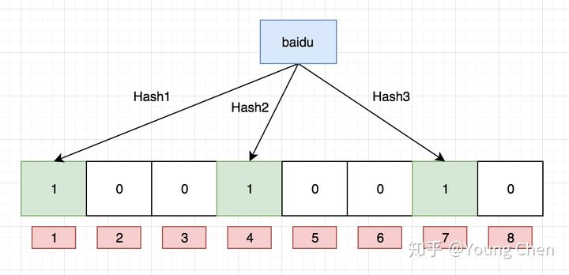

# 海量数据处理八股

[https://wangpengcheng.github.io/2019/12/17/hailiangshuju_problems/](https://wangpengcheng.github.io/2019/12/17/hailiangshuju_problems/)

数据结构：bitmap和布隆过滤器

[b](https://www.cnblogs.com/nijunyang/p/12833662.html)itmap：int类型4字节，在bitmap只需要一个bit就可以。 适合数据量很大，且数据相对密集的，因为数组的长度是和最大的数据值有关。缺点是只能处理纯数字，其他类型需要先hash，无法处理哈希冲突。java有一个bitset类

布隆过滤器：本质也是一个bitmap，但是对于数据，会用多个不同的哈希函数生成多个哈希值，并将对应哈希值的bit置为1，查询某个值存不存在时会查询生成的每个哈希值是否为1，如果有不为1的，那么说明一定不存在，如果都为1，也有可能不存在（其他值将这些位置1）

使用哈希函数过少的话误报率会变高，过多的话那么bitmap就有更多位置为1，当基本上都为1后，查询所有值都会返回可能存在，

Counting Bloom Filter 每一位扩展为一个小计数器，所以可以进行计数和删除操作

[Partial Bloom Filter](http://blog.csdn.net/jiaomeng/article/details/1502910)-原始布隆过滤器hash函数的值范围是整个数组，PBF中每个hash函数的取值范围较小，相互间没有交集，k个哈希函数可以并行访问数组，从而挺高程序性能

外部归并排序：将文件分为可以放入内存的小文件，在内存中对每个小文件进行排序，对这些排序后的小文件进行多路归并排序[https://zhuanlan.zhihu.com/p/343986766](https://zhuanlan.zhihu.com/p/343986766)

单位换算：
1byte=8bit

1KB = 2^10 byte = 10^3 byte

1MB = 2^20 byte =10^6 byte

1GB = 2^30 byte  =10^9byte

1亿  =10^8

**1.给定 a、b 两个文件，各存放 50 亿个 URL，每个 URL 各占 64B，内存限制是 4G。请找出 a、b 两个文件共同的 URL：**

内存只有4gb，需要5GB*64=320GB，所以需要使用分治策略：进行哈希取余；再对每个子文件进行 HashSet 统计

**如何允许有误差率的话可以用布隆过滤器**

**2.有一个 1GB 大小的文件，文件里每一行是一个词，每个词的大小不超过 16B，内存大小限制是 1MB，要求返回频数最高的 100 个词**

将文件中每个词根据哈希分为可以放入内存的小文件，每个小文件中用100的小根堆统计频数最高的100个词，最后可以用多路归并统计每个文件中有序的100个词汇总后的top 100

**3**.**现有海量日志数据保存在一个超大文件中，该文件无法直接读入内存，要求从中提取某天访问百度次数最多的那个 IP**

首先对文件进行一次遍历，把这一天访问百度 IP 的相关信息记录到一个单独的大文件中。接下来采用的方法与上一题一样，大致就是先对 IP 进行哈希映射，接着使用 HashMap 统计每个子文件重复 IP 的次数，最后用一个max变量遍历统计重复次数最多的 IP（只要最多的，所以不需要用堆）

**4.在 2.5 亿个整数中找出不重复的整数。注意：内存不足以容纳这 2.5 亿个整数。**

**用bitmap，压缩后装入内存 且要用2位的bitmap，00表示不存在，01表示出现一次，10表示出现多次**

**5.给定 40 亿个不重复的没排过序的 unsigned int 型整数，然后再给定一个数，如何快速判断这个数是否在这 40 亿个整数当中？**

bitmap只需要0.5GB，可以装入内存，给定数的时候去对应的bit位查看是否为1

**6.假设目前有 1000w 个记录（这些查询串的重复度比较高，虽然总数是 1000w，但如果除去重复后，则不超过 300w 个）。请统计最热门的 10 个查询串，要求使用的内存不能超过 1G**

（1）分治，分成能放入内存的小文件，统计每个小文件出现次数最多的10个字符串，最后用小顶堆统计所有小文件中出现次数最多的10个字符串

（2） 前缀树 压缩到前缀树中就可以放进内存，再用堆统计前10的字符串

**7.已知某个文件内包含一些电话号码，每个号码为 8 位数字，统计不同号码的个数。**

8位号码可以表示的号码个数为10^8=一亿个，用bitmap只需要12.5M内存，00000000这个号码对应bitmap中的第0位

**8.从 5 亿个数中找出中位数。数据排序后，位置在最中间的数就是中位数。当样本数为奇数时，中位数为 第 `(N+1)/2`个数；当样本数为偶数时，中位数为 第 `N/2`个数与第 `1+N/2`个数的均值。**

数据量小可以用双堆，大的时候只能用分治，首先按照每个数的最高位是1还是0分为两个文件a和b，那么a中的数一定都大于b中的数，然后再比较a和b中数的数量，如果a多那么中位数一定在a中。假设 b中有 1 亿个数，那么中位数一定在 a中，且是在 a中从小到大排列的第 1.5 亿个数与它后面的一个数的平均值。

> 提示，5 亿数的中位数是第 2.5 亿与右边相邻一个数求平均值。若 b有一亿个数，那么中位数就是a 中从第 1.5 亿个数开始的两个数求得的平均值。
> 

对于a，可以继续用次高位为1还是0继续划分，一直划分到文件可以加载进内存就放入内存中排序

**9. 有10 个文件，每个文件大小为 1G，每个文件的每一行存放的都是用户的 query，每个文件的 query 都可能重复。要求按照 query 的频度排序。**

内存不够装入所有query的话，分治：顺序遍历10个文件，通过哈希hash(query) % 10 将他们划分到10个小文件中，对每个小文件统计次数并在内存中排序，再使用外部归并排序对所有qeury排序

10.**有 20 个数组，每个数组有 500 个元素，并且有序排列。如何在这 20*500 个数中找出前 500 的数？**

多路归并，priorityQueue