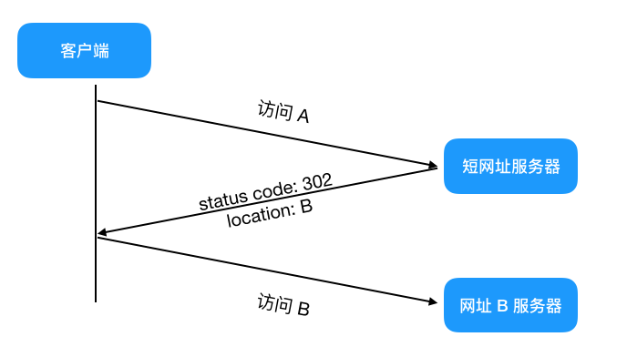

# 系统设计

**设计一个短链系统**：

短链生成方式一：对原始链接取Hash值，**通过布隆过滤器快速判断是否已经存了这个链接的hash**值。MurmurHash 是一种**非加密型**哈希函数，适用于一般的哈希检索操作。与其它流行的哈希函数相比，对于规律性较强的 key，MurmurHash 的随机分布特征表现更良好。非加密意味着着相比 MD5，SHA 这些函数它的性能肯定更高

计算后的哈希为10进制，我们还可以将他用62进制缩短(大小写字母52+数字10)，(3002604296)10 = (3hcCxy)62 

Hash生成如何处理碰撞问题？在原链后加一个自定义的特殊字段比如”DUPLICATE”,再进行哈希，通过短链取长链时会将这些特殊字段去除

短链生成方式二：这个就是不管来的是什么，通过集中的统一发号器，分配一个 ID，这个 ID 就是短链的内容，比如第一个来的就是[https://tinyurl.com/1](https://tinyurl.com/1)，第二个就是[https://tinyurl.com/2](https://tinyurl.com/2)，以此类推。当然可能一些分布式 ID 算法上来就是很长的一个序号了。

可以使用Redis自增或者Mysql的主键自增，也可以通过SnowFlake算法生成UUID

发号器的问题是：能通过已知的短网址，轻易推导出其他可用的短网址，

当短链请求时，会根据请求的短链字符串，从存储中找到数据，然后返回 HTTP 重定向到原始地址。如果存储使用关系型数据库，对于短链字段一般需要创建索引，而且为了避免数据库成为瓶颈，数据库前面还会通过缓存铺路。而且为了提高缓存合理使用，一般通过 LRU 算法淘汰非热点短链数据，使用布隆过滤器是为了防止缓存击穿，造成服务器压力过大。流程如下图：

**什么是一致性哈希（如何设计一个分布式的负载均衡策略）？**

[https://www.cnblogs.com/xiaolincoding/p/15918321.html](https://www.cnblogs.com/xiaolincoding/p/15918321.html)

分布式系统的负载均衡，如果节点数量发生变化，对系统进行扩容或者缩容时，必须迁移所有改变了映射关系的数据（绝大部分都会变）O（n）的迁移成本太高了，一致性哈希就是为了避免分布式系统在扩容或者缩容时，发生过多的数据迁移

一致哈希算法也用了取模运算，但与哈希算法不同的是，哈希算法是对节点的数量进行取模运算，而**一致哈希算法是对 2^32 进行取模运算，是一个固定的值，**映射的结果值往**顺时针的方向的找到第一个节点**，就是存储该数据的节点

新增节点时只有一个区间的需要迁移

删除节点同理

一致性哈希并不保证**节点能够在哈希环上分布均匀**

因此还可以引入虚拟节点，每个节点A对应n个分布在不同地方的虚拟节点，这样就极大程度上避免了数据不均匀导致节点压力不均衡的问题

**如何设计一个排行榜**

没有实时要求的话就类似于海量数据找topk，要么用小根堆省内存，要么用分治法，将数据分到可以放入内存的大小，每个组数据都找topk，最后每组的topk再一起比较

有实时性要求的话可以考虑Redis的Zset有序集合来实现，**按照分数进行分桶，**

**最后只需要查看最高分桶的Zset。 获取任意用户的排名也可以先获取在当前桶中的排名，再用zcard命令在O（1）时间获取前面所有的桶的用户个数。**

微信步数这种每个人一个排行榜，如果修改一个步数，所有用户对应的排行榜都要改的话就太耗资源了，而且每个用户的好友是有上限的，且用户还不一定看，可以延迟到用户点击查看排行榜的时候再根据用户的好友关系进行生成排行榜

最近七天，最近一月排行榜：对最近七天的数据求并集（zinterstore）。如果要去是最近7天都有数据的用户才进行统计，那就求交集

**如何设计朋友圈/Feed流系统**

feed流将用户主动订阅的若干消息源组合在一起形成内容聚合器，帮助用户持续地获取最新的订阅源内容。

根据实际场景，分为拉（读扩散）和推（写扩散）两种。如果订阅数量特别大的话，与其发布一条新信息就推送给所有订阅者，不如采用拉的方式，等订阅者上线的时候再进行当前订阅者已订阅人的数据拉取（订阅一般都有上限也是这个原因）。有效避免数据过度冗余产生的浪费（僵尸订阅者）

拉还可以有一些优化：每次拉取数据时参考上次拉取的时间，也就是说每次拉去的时候只是拉去新的，这样就减少了很多资源

微博一般是推拉结合但拉为主，大V是读扩散，其他大部分小用户都是写扩散

而微信好友一般只有三位数（最多四位数），因此可以以推为主。每当有action的时候就向所有的好友推送，每个用户接受的feed表都是单独的，每次刷新朋友圈不会一次次都去遍历所有朋友圈内容，而是去feed表抓取数据（所以微信不支持编辑操作，只有添加/删除）这里每个用户的feed表也可以使用redis的list双向链表进行存储，再定期存到数据库中

用户表 

用户好友关系表（分组、权限..）

每个用户自己的timeline表

每个用户自己的评论&赞表

发朋友圈后，会根据你设置的权限和好友关系表来判断给哪些好友的timeline表推送你这条朋友圈信息（所以每条朋友圈设置的权限后续不能更改）且包括自己的timeline表

像删除、拉黑、不给他看、三天可见这种可以随时修改的权限操作，也是会推送给相应好友的timeline，好友在打开朋友圈刷新时从timeline拉取信息，进行相应的权限操作

评论和赞：和timeline同理，A给B的朋友圈评论时，从B的好友中找所有能看到这条朋友圈的朋友，再从这些朋友里过滤不是A好友的用户，最后将这条评论推送给这些朋友的评论表中

**如何设计一个站内消息系统**？包括**系统通知、订阅事件提醒(up主更新)、用户事件提醒(点赞评论)和私信**

系统通知由后台管理员发出，指定某一类用户接收，系统消息建立一个系统表，每当用户登录就去系统表查看，把未读的系统消息读取并加入到个人信息表中（每个系统消息发出就加入到每个用户中的话，用户多的话一次插入几十上百万条数据会崩溃）

基于订阅模式的推送：可以用数据库（订阅关系表）也可以用消息队列，甚至可以用redis的发布订阅/Stream

提醒类事件：也是基于订阅，当用户发布文章或者评论的时候就订阅所有对它的点赞评论事件

提醒类消息的合并：拿的还是所有消息，应用层面进行聚合？

私信：

**如何设计订单号生成规则**？

订单的必要规则：

1.不重复 UUID

2.安全性 订单编号不能透露公司的真实运营信息，比如订单就是流水号的话，那么别人就可以从订单号推测出公司的整体运营概括了。所以订单编码必须是除了公司少部分人外，其他人基本看不懂的

3.高并发情况下快速生成且不能生成重复

年月日时分秒+用户id+商品id+自增树

时间保证唯一性，用户ID+时间保证高并发下的正确性。用户ID通过区域ID+随机数+流水号，保证安全性，用户ID不会被识别并推导出其他用户ID

**如何设计（分布式）UUID**？

**UUID**：[UUID](https://en.wikipedia.org/wiki/Universally_unique_identifier)是一类算法的统称，具体有不同的实现。但是相同的是每台机器可以独立产生ID，理论上保证不会重复，所以天然是分布式的，缺点是生成的ID太长，不仅占用内存，而且索引查询效率低

**数据库集群自增ID**：设置每个子库的起始值和自增步长，保证不同库生成的自增ID不同，比如有两个子库，那起始值分别为1和2，自增步长设置为2

**SnowFlake算法**：通过一些简单的规则保证在大规模分布式情况下生成唯一的 ID 号码

第一个 bit 为未使用的符号位。

第二部分由 41 位的时间戳（毫秒）构成，它的取值是当前时间相对于某一时间的偏移量。

第三部分和第四部分的 5 个 bit 位表示数据中心和机器 ID，其能表示的最大值为 2^5 -1 = 31。

最后部分由 12 个 bit 组成，其**表示每个工作节点每毫秒生成的序列号 ID**，同一毫秒内最多可生成 2^12 -1 即 **4095 个 ID**。

**Redis Incre自增**：

**如何设计一个定时任务调度器？**

阻塞队列+polling

延迟队列

todo

**如何设计接口限流**？

**固定窗口计数器**：将时间划分为多个窗口， 在每个窗口内每有一次请求就将计数器加一。如果计数器超过了限制数量，则本窗口内所有的请求都被丢弃 当时间到达下一个窗口时，计数器重置。

这个算法有时会让通过请求量允许为限制的两倍。考虑如下情况：限制 1 秒内最多通过 5 个请求，在第一个窗口的最后半秒内通过了 5 个请求，第二个窗口的前半秒内又通过了 5 个请求。这样看来就是在 1 秒内通过了 10 个请求。

**滑动窗口计数器**：将时间划分为多个区间，在每个区间内每有一次请求就将计数器加一维持一个时间窗口，占据多个区间，每经过一个区间的时间，则抛弃最老的一个区间，并纳入最新的一个区间，如果当前窗口内区间的请求计数总和超过了限制数量，则本区间内所有的多余请求都被丢弃

避免了固定窗口计数器带来的双倍突发请求，但时间区间的精度越高，算法所需的空间容量就越大

**漏桶算法**：

将请求放在队列中，以固定速率处理队列中的请求

当短时间内有大量的突发请求时，即便此时服务器没有任何负载，每个请求也都得在队列中等待一段时间才能被响应

****令牌桶算法：****

令牌以固定速率生成。生成的令牌放入令牌桶中存放，如果令牌桶满了则多余的令牌会直接丢弃，当请求到达时，会尝试从令牌桶中取令牌，取到了令牌的请求可以执行，如果桶空了，那么尝试取令牌的请求会被直接丢弃

既能够将所有的请求平均分布到时间区间内，又能接受服务器能够承受范围内的突发请求，因此是目前使用较为广泛的一种限流算法

单实例限流的话Guava提供了令牌桶算法实现

分布式令牌桶可以用redis实现：hashmap -key为接口的id，value是当前令牌

当请求到来时，先根据redis保存的上次的请求时间和当前时间比较，如果相差大于产生令牌的时间（假设1秒）则再次产生令牌，如果相差时间为6s，则生成6个新令牌（不是每秒都去redis进行+1操作，有请求来时计算就行）生成完令牌后再进行消费（令牌-1）

如果要求限流且请求不能丢弃，那就只能用消息队列了，以固定速率去消息队列中按顺序读请求

**如何设计一个权限系统**？

从权限模型的角度来说，用的多的有两种：基于角色的访问控制（role-based access control RBAC)和基于属性的访问控制（attribute-based access control ABAC）

RBAC与ABAC之间的主要区别在于方法授予访问权限的方式。 RBAC按照角色授予访问权限，ABAC可以根据用户特征，对象特征，操作类型等属性确定访问权限。

对于中小型组织，维护角色和授权关系的工作量不大，反而定制各种策略相对麻烦。对于大型组织，基于RBCA的控制模型需要维护大量的角色和授权关系，且无法做到对资源细粒度地授权，而ABAC更加灵活，且可更加细粒度的控制和根据上下文动态执行（比如特定时间等，RBAC需要在业务层面维护），缺点在于模型策略构建相对复杂

RBAC将权限抽象出一层角色概念，解耦

拓展：可能有一些角色不能由同一个人担任（采购和审核），也可能某些角色只能由一个人担任，因此要约束某些角色对应的用户数量，或者有些业务场景下多角色用户仅允许使用一个角色

RBAC3：[https://segmentfault.com/a/1190000039676989](https://segmentfault.com/a/1190000039676989)

职业和角色1对1

引入组织架构，用户加入组织后自动获得组织的全部角色。同时用户在调岗时，只需调整组织，角色即可批量调整

接口权限用拦截器实现，访问用户-角色-权限表确认该用户对接口是否有调用权限

前端的菜单或者页面的访问权限，甚至细分到按钮级别的访问权限，也是通过数据库中存了对应的用户-角色-权限表实现-

按钮权限：给按钮设置权限编号，后端有一个表维护权限列表，在初始化时会从数据库拉取存到前端，根据权限列表使用v-if指令或者 绑定disabled属性达到相应权限效果

菜单权限列表是后台直接返回的，会根据用户角色返回用户可以看到的菜单

路由权限- 先注册好所有的路由，然后获取有资格访问的路由权限列表，最后直接通过Router.beforeEach来判断，每次跳路由的时候判断是否在权限列表里，在的话就放行，不在就跳转到403

黑白名单超级管理员

**如何设计工作流**？

工作流是将一组任务组织起来以完成某个经营过程：定义了任务的触发顺序和触发条件

[https://www.cxyxiaowu.com/20709.html](https://www.cxyxiaowu.com/20709.html)

**设计一个服务器连接1000万用户请求**

[https://github.com/doocs/advanced-java/blob/main/docs/high-concurrency/high-concurrency-design.md](https://github.com/doocs/advanced-java/blob/main/docs/high-concurrency/high-concurrency-design.md)

**推送场景，50 条内容，定时推送，先推 5%用户，一段时间后再找出 效果最好的几条，推给所有用户**

**浏览器扫码登录是如何实现的？**

服务器收到浏览器登录请求后，随机生成一个uuid，将这个id作为key值存入redis服务器，同时设置一个过期时间，过期后，用户登录二维码需要进行刷新重新获取。同时，将这个uuid和验证字符串合在一起，通过二维码生成接口，生成一个二维码的图片返回给浏览器。

手机扫码：解析二维码图片得到一个验证信息和一个uuid，因为扫码的app已经进行了验证登录，有token信息，将这些信息和uuid一起发送验证登录请求，服务器校验参数且判断有无过期后返回确认信息，点击确认后。服务器收到确认将uuid为key，userid为value存入缓存（redis）中

浏览器登录成功：浏览器通过uuid请求服务器，服务器去查redis，得到对应用户的userid，根据这些信息生成一个token返回给浏览器，之后都带token来请求就行了（只要没过期）

**红包随机算法怎么设计？**

微信的红包算法

当前平均值是10，那就在0-20间波动（二倍平均值法）

**带权重随机数的抽奖**：

根据权重确定有效的随机区间长度

[https://bigjun2017.github.io/2019/05/19/hou-duan/java/dai-quan-chong-de-sui-ji-shu-suan-fa-de-shi-xian/](https://bigjun2017.github.io/2019/05/19/hou-duan/java/dai-quan-chong-de-sui-ji-shu-suan-fa-de-shi-xian/)

****如何实现接口的幂等性（比如某些业务场景下的更新操作不能更新两次，也用于重复消费消息队列消息的解决方案）****

**唯一id**。**每次操作，都根据操作和内容生成唯一的id**，在执行之前先判断id是否存在，如果不存在则执行后续操作，并且保存到数据库或者[redis](https://www.nowcoder.com/jump/super-jump/word?word=redis)等。

服务端提供发送token的接口，业务调用接口前先获取token,然后调用业务接口请求时，把token 携带过去,务器判断token是否存在[redis](https://www.nowcoder.com/jump/super-jump/word?word=redis)中，存在表示第一次请求，可以继续执行业务，执行业务完成后，最后需要把[redis](https://www.nowcoder.com/jump/super-jump/word?word=redis)中的token删除

建去重表。将业务中有唯一标识的字段保存到去重表，如果表中存在，则表示已经处理过了 版本控制。增加版本号，当版本号符合时，才能更新数据

状态控制。例如订单有状态已支付 未支付 支付中 支付失败，当处于未支付的时候才允许修改为支付中等

**如何设计一个购物车**？

数据库存，太多太慢

cookie保存购物车信息，可以做到本地购物车（不需要登录就可加入商品），但在用户禁用cookie时就没法使用

session保存购物车信息，也是存在数据库中，而且每次请求携带的数据大。

redis的hash存购物车信息，key为用户id（给redis购物车信息加入过期时间；如果用户是登录状态，可以用用户ID做标识符，就不需要给过期时间了）

**如何设计大文件上传的断点续传**？

拿到文件，保存文件唯一性标识，切割文件，分段上传，每次上传一段，根据唯一性标识判断文件上传进度，直到文件的全部片段上传完毕

上传过程中将文件在服务器写为临时文件，等全部写完了（文件上传完且校验完毕），将此临时文件重命名为正式文件即可