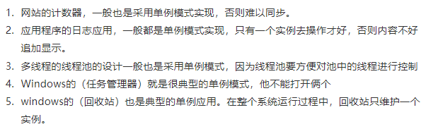

# 设计模式

[https://juejin.cn/post/6844904125721772039](https://juejin.cn/post/6844904125721772039)

六大原则：

开放封闭原则：对修改封闭，对拓展开放。强调用抽象构建框架，用实现扩展细节，提高代码的可复用性和可维护性

里氏替换原则：可以在任何地方使用继承的子类来替换基类-子类可以扩展父类的功能，但不能改变父类原有的功能

依赖倒转原则：面向接口编程时依赖于抽象类或者接口而不依赖于具体实现类，在程序代码中传递参数时或在关联关系中，尽量引用层次高的抽象层类

接口隔离原则：将不同功能定义在不同接口中实现接口隔离，避免了类依赖它不需要的接口，减少了接口之间依赖的冗余性和复杂性。

迪米特里原则：最少知道原则，每个模块对其他模块都要尽可能少地了解和依赖，降低代码耦合度

单一职责原则：一个类、接口或方法只负责一个职责，降低代码复杂度以及变更引起的风险

**单例模式：** [https://hefeijoe.github.io/post/singeleton/](https://hefeijoe.github.io/post/singeleton/)

代码见codeDebug 懒汉饿汉 双重检验 枚举 内部类..

保证一个类只有一个实例，并且提供一个全局访问点。在系统内存中只存在一个对象，因此可以节约系统资源，当需要频繁创建和销毁的对象时单例模式无疑可以提高系统的性能

不适用于变化的对象，如果同一类型的对象总是要在不同的用例场景发生变化，单例就会引起数据的错误，不能保存彼此的状态



源码应用：Spring中的依赖注入Bean实例默认是单例（也可以是prototype、request等其他）的。发生在AbstractBeanFactory的getBean里的doGetBean里的getSingleton方法，进行bean的创建（使用的是双重校验的单例模式，有一个三级map缓存来校验该类是否已经有实例）

getbean的流程：[https://bbs.huaweicloud.com/blogs/detail/300161](https://bbs.huaweicloud.com/blogs/detail/300161) 

[https://www.cnblogs.com/java-chen-hao/p/11139157.html](https://www.cnblogs.com/java-chen-hao/p/11139157.html)

除了创建实例以外，还需要先创建bean依赖的接口和类并处理循环依赖问题，getbean最终是使用反射或者cglib动态代理的方式创建bean

spirng可以处理单例模式的Setter（字段）循环依赖问题，构造器的循环依赖以及原型模式的循环依赖会直接抛出异常  [https://www.cnblogs.com/lifullmoon/p/14452887.html](https://www.cnblogs.com/lifullmoon/p/14452887.html)

getbean时从先三级map缓存中尝试获取对象，通过第三级map 提前暴露正在创建中的单例类实例，通过提前暴露的方式获取这个早期对象，避免再次初始化。从而解决单例模式Setter和field注入的循环依赖问题


**工厂模式**：创建对象时不会对客户端暴露创建逻辑，并且是通过使用一个共同的接口来指向新创建的对象。实现了创建者和调用者分离。降低程序的耦合性，修改创建逻辑只需要修改工厂的生产逻辑

具体又分为简单工厂、工厂方法、抽象工厂模式

简单工厂 ：用来生产同一等级结构中的任意产品。（不支持拓展增加产品）
工厂方法 ：用来生产同一等级结构中的固定产品。（支持拓展增加产品）
抽象工厂 ：用来生产不同产品族的全部产品。（不支持拓展增加产品；支持增加产品族）

[https://juejin.cn/post/6844904125721772039](https://juejin.cn/post/6844904125721772039)

简单工厂 一个工厂创建（同一等级结构中的）所有产品。适用于工厂类负责创建对象种数较少的情况，缺点是如果要增加新产品，就需要修改工厂类的判断逻辑，违背开闭原则，且产品多的话会使工厂类比较复杂，不便于维护。

工厂方法把工厂类进行了抽象，有一个工厂父接口，每一种产品需要创建对应的工厂类继承工厂父接口，新增产品只需要创建一个新的子工厂类就可以，不需要修改原有代码

抽象工厂模式 引入策略模式进一步进行抽象，工厂方法是父接口定义好这个产品族的公用创建接口，比如汽车就是createCar()，再由子工厂去具体实现这个函数。而对于船来说需要是createBoat()，所以汽车的父工厂没法生产船（不同产品组）

所以引入一个工厂的抽象工厂，抽象工厂包含了createCar和createBoat方法，抽象工厂的实现工厂来实现createCar或者createBoat

源码应用：Spring中的依赖注入Bean实例的创建也使用了工厂模式（大部分是简单工厂模式），创建一个BeanFactory，调用beanFactory.getBean(类名，类.class)来创建相应的类实例。

工厂+单例模式实现bean注入的优点：三层架构中，控制层调用业务层，业务层调用数据访问层，如果不使用工厂模式向spring容器注入对应bean实例的话，每一次调用都要new一个对象，不止耦合性大大提高，而且创建了很多对象。

Spring中使用注入Map的方式可以优雅的实现工厂方法模式（进一步配合枚举类）

[https://blog.csdn.net/qq_33697094/article/details/113860761](https://blog.csdn.net/qq_33697094/article/details/113860761)

**代理模式**：通过代理控制对象的访问，因此可以在这个对象调用方法之前、调用方法之后统一的去处理/添加新的功能。在原有代码乃至原业务流程都不修改的情况下，直接在业务流程中切入新代码，增加新功能

分为静态代理和动态代理，静态代理是提前写好代理类，动态代理是在运行时根据对象参数通过proxy和invocationhandler（反射）去动态的生成代理类，节省空间，动态代理也可以通过cglib字节码技术实现（反射没法处理没有实现任何接口的类）

源码应用：proxy和invocationhandler的动态代理方式。Spring的AOP就是基于动态代理实现，还有mybatis的mapper

**观察者模式**：发布订阅模型，有推和拉两种实现方式

java util库中内置一个Observable类

EventListener和HttpSessionBindingListner等都是基于观察者模式

回调函数是一对一的观察者模式，EventListener就是一个事件监听回调的实现，

EventTarget.addEventListener() 方法将指定的监听器注册到 `[EventTarget](https://developer.mozilla.org/zh-CN/docs/Web/API/EventTarget)`上，当该对象触发指定的事件时，指定的回调函数就会被执行

```java
// 发布者抽象类
public abstract class Subject {
    /**
     * 用来保存注册的观察者对象
     */
    private    List<Observer> list = new ArrayList<Observer>();
    /**
     * 注册观察者对象
     * @param observer    观察者对象
     */
    public void attach(Observer observer){
        
        list.add(observer);
        System.out.println("Attached an observer");
    }
    /**
     * 删除观察者对象
     * @param observer    观察者对象
     */
    public void detach(Observer observer){
        
        list.remove(observer);
    }
    /**
     * 发布信息，通知所有注册的观察者对象
     */
    public void nodifyObservers(String newState){
        
        for(Observer observer : list){
            observer.update(newState);
        }
    }
}

// 发布者具体实现类
public class ConcreteSubject extends Subject{
    
    private String state;
    
    public String getState() {
        return state;
    }

    public void change(String newState){
        state = newState;
        System.out.println("主题状态为：" + state);
        //状态发生改变，通知各个观察者
        this.nodifyObservers(state);
    }
}

// 抽象观察者接口
public interface Observer {
    /**
     * 更新接口
     * @param state    更新的状态
     */
    public void update(String state);
}

// 具体观察者实现类
public class ConcreteObserver implements Observer {
    //观察者的状态
    private String observerState;
    
    @Override
    public void update(String state) {
        /**
         * 更新观察者的状态，使其与目标的状态保持一致
         */
        observerState = state;
        System.out.println("状态为："+observerState);
    }

}

public static void main(String[] args) {
        //创建主题对象
        ConcreteSubject subject = new ConcreteSubject();
        //创建观察者对象
        Observer observer = new ConcreteObserver();
        //将观察者对象登记到主题对象上
        subject.attach(observer);
        //改变主题对象的状态
        subject.change("new state");
    }

```

**建造者模式**：将一个复杂的对象的构建与它的表示分离，使得同样的构建过程可以创建不同的方式进行创建。比如穿衣服，可以穿不同的上衣裤子和鞋子，也可以只穿上衣裤子不传鞋子（和模板方法模式的区别在于构造流程不是固定的），通过调用buildCompleted()方法来返回建造的对象，也可以每次建造（穿衣or传裤子）都返回this对象来实现链式赋值

**模板方法模式**：将不变的步骤写在父类中，可能变化的步骤抽象出来由子类来实现

带template的都是模板方法模式 如jdbctemplate resttemplate *RedisTemplate*

以redistemplate为例

写一个配置类（@configuration），定义函数完成redistemplate的创建和配置过程并返回这个redistemplate，用@bean注解将它加入到spring容器中管理，使用时候也是用注解去容器中获取，然后就可以使用haskey、set、delete等操作。一般使用都是有获取连接、执行命令、释放连接等固定过程，template只将执行命令这一步骤暴露出来，所以是模板方法模式

```java
//模板方法
public abstract class RestaurantTemplate {
// 1.看菜单
public void menu() {
	System.out.println("看菜单");
}

// 2.点菜业务
abstract void spotMenu();

// 3.吃饭业务
public void havingDinner(){ System.out.println("吃饭"); }

// 3.付款业务
abstract void payment();

// 3.走人
public void GoR() { System.out.println("走人"); }

//模板通用结构
public void process(){
	menu();
	spotMenu();
	havingDinner();
	payment();
	GoR();
}
}

public class RestaurantGinsengImpl extends RestaurantTemplate {

    void spotMenu() {
        System.out.println("人参");
    }

    void payment() {
        System.out.println("5快");
    }
}

public static void main(String[] args) {
        //调用第一个模板实例
        RestaurantTemplate restaurantTemplate = new RestaurantGinsengImpl();
        restaurantTemplate.process();
    }

```

**原型模式**：单例模式的扩展，类初始化需要消化非常多的资源，但是每个类又会有自己的变化，所以不能用单例，那么就用原型模式进行拷贝，避免new产生一个对象的非常繁琐的数据准备或者权限

实现cloneable接口，并且重写clone方法

**策略模式**：简化大量if操作（比如简单工厂模式中增加新产品就需要增加if），随意增加新策略 对扩展开放，父类可以通过子类切换不同的策略（依赖倒转）

**装饰模式**：在不改变原有类的情况下，能够动态的给类添加一些新的职责和功能

IO中使用的很多，比如BufferedReader和BufferedWriter 增强了Reader和Writter对象，添加缓冲池

**适配器模式**：将一个类的接口转换成另外一个接口使得原本由于接口不兼容而不能一起工作的类可以一起工作。

Adapter结尾的类基本都用了适配器模式